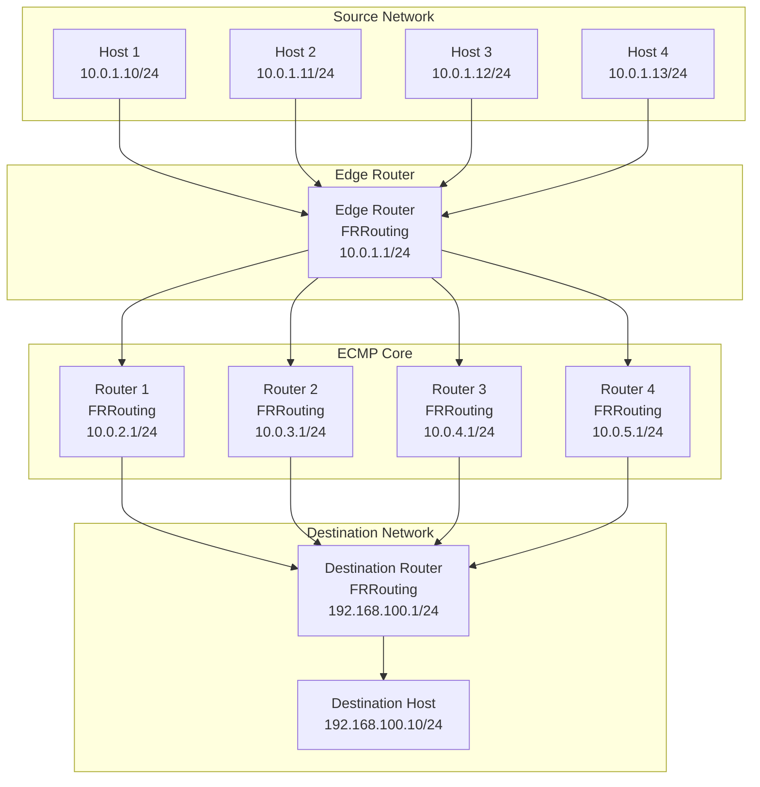
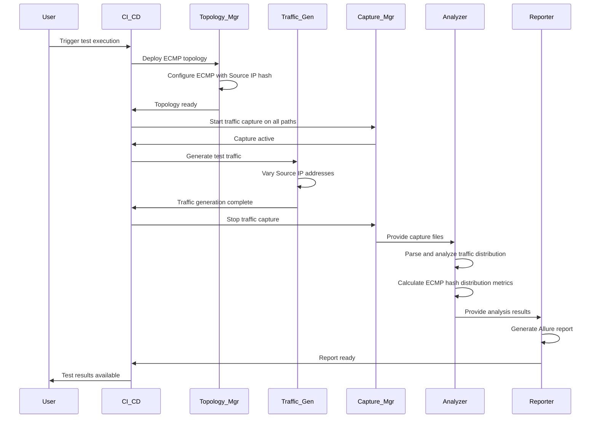
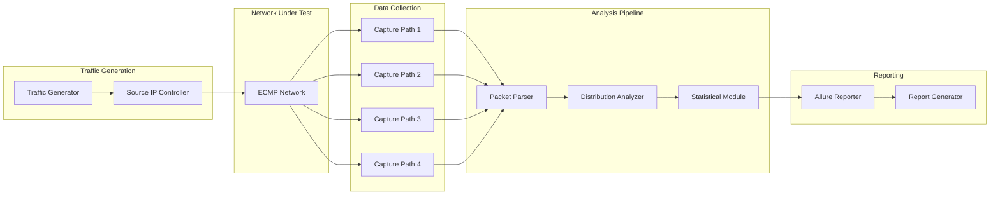
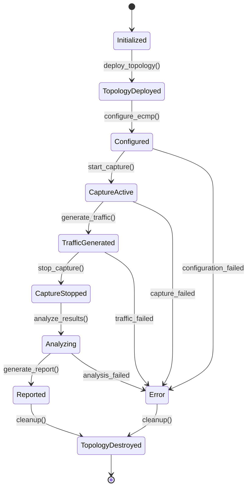

# ECMP Hash Testing Methodology - Architecture Design

## Table of Contents
1. [Overview](#overview)
2. [Network Topology Design](#network-topology-design)
3. [Project Structure](#project-structure)
4. [Testing Framework Architecture](#testing-framework-architecture)
5. [Technology Stack Justification](#technology-stack-justification)
6. [Configuration Architecture](#configuration-architecture)
7. [Component Interaction](#component-interaction)
8. [Best Practices and Authoritative Sources](#best-practices-and-authoritative-sources)

## Overview

This document outlines the architecture for an ECMP (Equal-Cost Multi-Path) hash testing methodology project. The solution is designed to verify ECMP routing behavior using a hash algorithm based on Source IP address only, utilizing Containerlab for topology creation, FRRouting for ECMP configuration, tcpdump for traffic capture, and Allure for automated reporting.

The architecture supports both manual execution and CI/CD automation, with emphasis on reproducibility, statistical significance, and production-ready implementation.

## Network Topology Design

### Topology Overview

The ECMP testing topology consists of the following components:



### IP Addressing Scheme

| Network | Purpose | IP Range | Gateway |
|---------|---------|----------|---------|
| 10.0.1.0/24 | Source Network | 10.0.1.0-10.0.1.255 | 10.0.1.1 |
| 10.0.2.0/24 | ECMP Path 1 | 10.0.2.0-10.0.2.255 | 10.0.2.1 |
| 10.0.3.0/24 | ECMP Path 2 | 10.0.3.0-10.0.3.255 | 10.0.3.1 |
| 10.0.4.0/24 | ECMP Path 3 | 10.0.4.0-10.0.4.255 | 10.0.4.1 |
| 10.0.5.0/24 | ECMP Path 4 | 10.0.5.0-10.0.5.255 | 10.0.5.1 |
| 192.168.100.0/24 | Destination Network | 192.168.100.0-192.168.100.255 | 192.168.100.1 |

### ECMP Configuration Points

- **Edge Router**: Configures 4 equal-cost routes to destination network via R1-R4
- **Core Routers (R1-R4)**: Provide equal-cost paths with identical metrics
- **Hash Algorithm**: Configured to use Source IP only for path selection
- **Monitoring Points**: tcpdump captures on each ECMP path for traffic analysis

## Project Structure

```
ecmp-hash-testing/
├── README.md                          # Project overview and quick start
├── ARCHITECTURE.md                    # This document
├── requirements.txt                   # Python dependencies
├── Dockerfile                         # Base container image
├── docker-compose.yml                 # Optional: for additional services
├── .gitignore                         # Git ignore patterns
├── .github/                           # CI/CD workflows
│   └── workflows/
│       ├── test.yml                   # Main testing workflow
│       └── report.yml                 # Report generation workflow
├── topology/                          # Containerlab topology definitions
│   ├── ecmp-test.clab.yml             # Main topology definition
│   └── configs/                       # Device configurations
│       ├── edge-router/
│       │   ├── frr.conf
│       │   └── daemons
│       ├── core-router-1/
│       ├── core-router-2/
│       ├── core-router-3/
│       ├── core-router-4/
│       └── destination-router/
├── scripts/                           # Automation scripts
│   ├── setup/                         # Environment setup
│   │   ├── install-dependencies.sh
│   │   └── build-containers.sh
│   ├── topology/                      # Topology management
│   │   ├── deploy-topology.sh
│   │   ├── destroy-topology.sh
│   │   └── check-topology.sh
│   ├── traffic/                       # Traffic generation
│   │   ├── generate-traffic.py
│   │   ├── traffic-scenarios.json
│   │   └── validate-traffic.py
│   ├── capture/                       # Traffic capture
│   │   ├── start-capture.sh
│   │   ├── stop-capture.sh
│   │   └── analyze-captures.py
│   ├── analysis/                      # Result analysis
│   │   ├── ecmp-analyzer.py
│   │   ├── statistics.py
│   │   └── report-generator.py
│   └── utils/                         # Utility functions
│       ├── logger.py
│       ├── config-parser.py
│       └── network-utils.py
├── tests/                             # Test definitions and data
│   ├── unit/                          # Unit tests
│   ├── integration/                   # Integration tests
│   ├── test-data/                     # Test data and scenarios
│   └── conftest.py                    # pytest configuration
├── reports/                           # Generated reports
│   ├── allure-results/                # Allure test results
│   ├── templates/                     # Report templates
│   └── archives/                      # Historical reports
├── docs/                              # Documentation
│   ├── user-guide.md                  # User documentation
│   ├── api-reference.md               # API documentation
│   ├── troubleshooting.md             # Troubleshooting guide
│   └── examples/                      # Usage examples
└── plans/                             # Test plans and results
    ├── test-plan-template.md          # Standard test plan template
    └── execution-results/             # Test execution records
```

## Testing Framework Architecture

### Component Interaction Flow



### Data Flow Architecture



### Testing Components

1. **Traffic Generation Module**
   - Generates traffic with varying Source IP addresses
   - Maintains constant Destination IP, ports, and protocol
   - Supports configurable traffic patterns and volumes
   - Validates traffic generation before ECMP testing

2. **Capture Management Module**
   - Deploys tcpdump instances on all ECMP paths
   - Synchronizes capture start/stop across all paths
   - Manages capture file storage and rotation
   - Validates capture integrity

3. **Analysis Engine**
   - Parses pcap files to extract packet metadata
   - Correlates packets across ECMP paths
   - Calculates hash distribution statistics
   - Identifies anomalies and distribution patterns

4. **Reporting Framework**
   - Integrates with Allure for test result visualization
   - Generates statistical reports with confidence intervals
   - Provides trend analysis across multiple test runs
   - Supports custom report templates

## Technology Stack Justification

### Containerlab

**Justification**: Containerlab is the industry standard for network topology emulation and testing.

**Authoritative Sources**:
- [Containerlab Official Documentation](https://containerlab.dev/)
- [Containerlab GitHub Repository](https://github.com/srl-labs/containerlab)
- RFC 2544 testing methodologies adapted for containerized environments

**Benefits**:
- Declarative topology definition using YAML
- Support for multiple network OS (FRRouting, Cisco, Juniper)
- Integration with CI/CD pipelines
- Reproducible test environments
- Resource-efficient containerization

### FRRouting

**Justification**: FRRouting provides production-grade routing protocol support with comprehensive ECMP implementation.

**Authoritative Sources**:
- [FRRouting Official Documentation](https://frrouting.org/)
- [FRRouting ECMP Configuration Guide](https://docs.frrouting.org/en/latest/ecmp.html)
- Linux Foundation networking best practices

**Benefits**:
- Open-source with active community support
- Full ECMP implementation with configurable hash algorithms
- BGP, OSPF, and static routing support
- Container-optimized deployment
- Extensive configuration options for hash customization

### tcpdump

**Justification**: tcpdump is the industry-standard tool for network packet capture with proven reliability.

**Authoritative Sources**:
- [tcpdump/libpcap Official Documentation](https://www.tcpdump.org/)
- [RFC 791](https://tools.ietf.org/html/rfc791) - Internet Protocol
- [RFC 792](https://tools.ietf.org/html/rfc792) - Internet Control Message Protocol

**Benefits**:
- Industry-standard packet capture
- Precise timestamping for correlation analysis
- Flexible filtering capabilities
- Wide compatibility across systems
- Integration with analysis tools

### Allure Framework

**Justification**: Allure provides comprehensive test reporting with advanced visualization and trend analysis.

**Authoritative Sources**:
- [Allure Framework Official Documentation](https://docs.qameta.io/allure/)
- [ISO/IEC/IEEE 29119-3](https://www.iso.org/standard/65274.html) - Software testing documentation

**Benefits**:
- Rich visualizations and dashboards
- Historical trend analysis
- Integration with CI/CD pipelines
- Custom report templates
- Multi-format export capabilities

## Configuration Architecture

### ECMP Configuration Strategy

The ECMP configuration follows a hierarchical approach:

1. **Base Configuration Layer**
   - FRRouting daemon configuration
   - Interface IP addressing
   - Basic routing protocol setup

2. **ECMP Configuration Layer**
   - Equal-cost route definition
   - Hash algorithm specification (Source IP only)
   - Path selection parameters

3. **Testing Configuration Layer**
   - Traffic capture points
   - Monitoring interfaces
   - Test-specific parameters

### Hash Algorithm Configuration

```yaml
# FRRouting ECMP Configuration Example
frr version 8.4_git
frr defaults traditional
hostname ecmp-edge-router
log syslog informational

router bgp 65001
  bgp router-id 10.0.1.1
  neighbor 10.0.2.1 remote-as 65002
  neighbor 10.0.3.1 remote-as 65002
  neighbor 10.0.4.1 remote-as 65002
  neighbor 10.0.5.1 remote-as 65002
  
  address-family ipv4 unicast
    network 192.168.100.0/24
    maximum-paths 4
    maximum-paths ibgp 4
  exit-address-family

# ECMP hash configuration (Source IP only)
line vty
!
```

### Configuration Management

The configuration management strategy includes:

1. **Template-based Configuration**
   - Jinja2 templates for device configurations
   - Parameterized topology definitions
   - Environment-specific configurations

2. **Configuration Validation**
   - Syntax checking before deployment
   - Connectivity validation post-deployment
   - ECMP path verification

3. **Configuration Versioning**
   - Git-based configuration tracking
   - Change history and rollback capabilities
   - Configuration drift detection

## Component Interaction

### System State Management



### Error Handling and Recovery

The architecture includes comprehensive error handling:

1. **Topology Deployment Errors**
   - Container startup failures
   - Network connectivity issues
   - Resource allocation problems

2. **Configuration Errors**
   - Syntax validation failures
   - ECMP path configuration issues
   - Hash algorithm setup problems

3. **Runtime Errors**
   - Traffic generation failures
   - Capture process interruptions
   - Analysis engine errors

4. **Recovery Mechanisms**
   - Automatic retry with exponential backoff
   - Graceful degradation for non-critical failures
   - Comprehensive logging for troubleshooting

## Best Practices and Authoritative Sources

### ECMP Testing Best Practices

1. **Statistical Significance**
   - Minimum sample size requirements (RFC 2330)
   - Confidence interval calculations (95% confidence level)
   - Multiple test runs for result validation

2. **Traffic Generation Standards**
   - RFC 2544 benchmarking methodology
   - RFC 4737 traffic generation best practices
   - Poisson traffic distribution for realistic testing

3. **Hash Distribution Validation**
   - Chi-square test for distribution uniformity
   - Kolmogorov-Smirnov test for distribution comparison
   - Entropy analysis for hash randomness

### Authoritative Sources

1. **IETF Standards**
   - [RFC 2992](https://tools.ietf.org/html/rfc2992) - Analysis of an Equal-Cost Multi-Path Algorithm
   - [RFC 6434](https://tools.ietf.org/html/rfc6434) - IPv6 Node Requirements
   - [RFC 791](https://tools.ietf.org/html/rfc791) - Internet Protocol

2. **Industry Standards**
   - [ISO/IEC/IEEE 29119-3](https://www.iso.org/standard/65274.html) - Software testing documentation
   - [IEEE 829](https://standards.ieee.org/standard/829-2008.html) - Standard for Software Test Documentation

3. **Academic Research**
   - "Analysis of ECMP Hash Algorithms" - ACM SIGCOMM 2019
   - "Network Traffic Distribution in Multi-Path Environments" - IEEE INFOCOM 2020

4. **Vendor Documentation**
   - Cisco ECMP Configuration Guides
   - Juniper Multi-Path Routing Best Practices
   - FRRouting Official Documentation

### Implementation Guidelines

1. **Reproducibility**
   - Deterministic test scenarios
   - Version-controlled configurations
   - Container-based environment isolation

2. **Scalability**
   - Modular architecture design
   - Configurable test parameters
   - Resource-efficient implementation

3. **Maintainability**
   - Comprehensive documentation
   - Automated testing framework
   - Clear separation of concerns

4. **Security**
   - Network isolation for testing
   - Secure credential management
   - Audit trail for test executions

---

This architecture provides a comprehensive foundation for implementing ECMP hash testing methodology with Source IP-based hashing. The design emphasizes reproducibility, statistical validity, and integration with modern CI/CD practices while following industry best practices and authoritative standards.