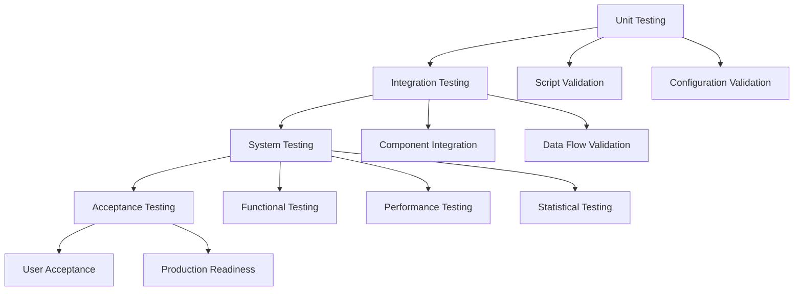
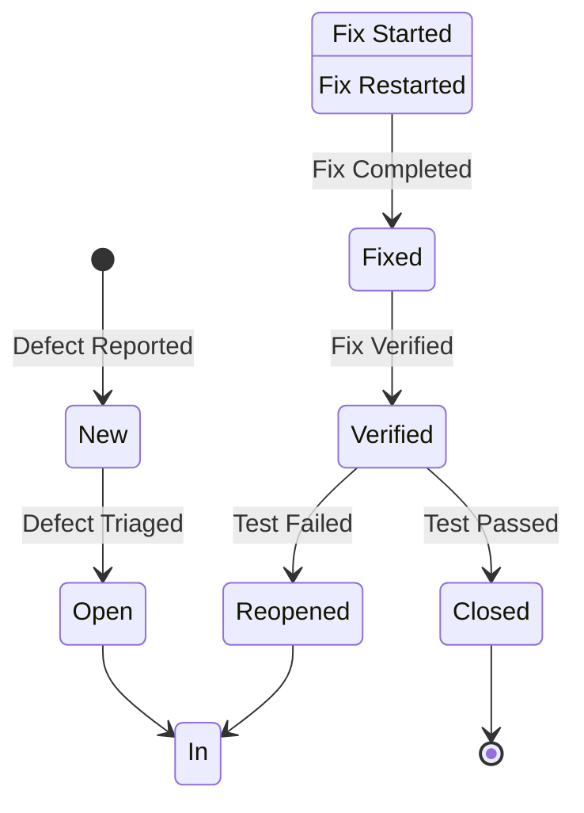
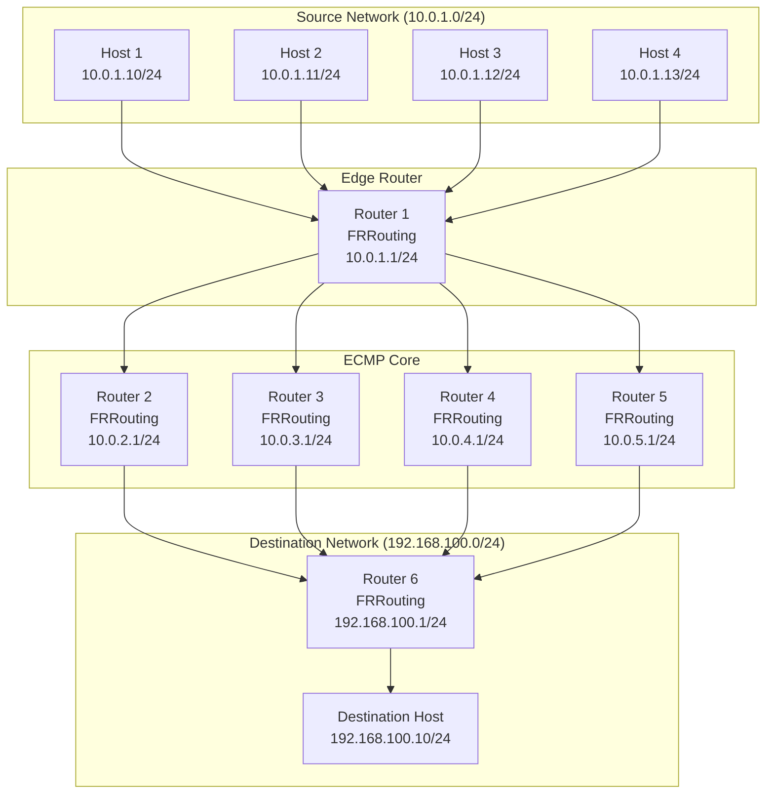
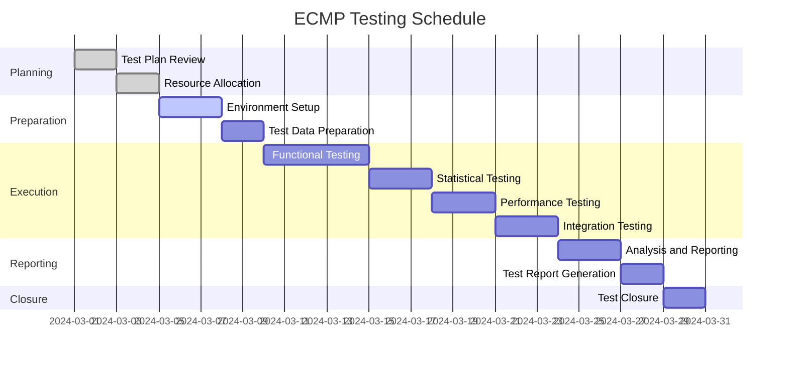

# ECMP Hash Testing - Test Plan

## Document Information

| Field | Value |
|-------|-------|
| **Document Title** | ECMP Hash Testing - Test Plan |
| **Document Version** | 1.0 |
| **Document Date** | 2024-03-05 |
| **Document Status** | Final |
| **Project Name** | ECMP Hash Testing Framework |
| **Test Manager** | ECMP Testing Team |
| **Approval Date** | 2024-03-05 |
| **Standards Compliance** | ISO/IEC/IEEE 29119-3, IEEE 829 |

---

## Table of Contents
1. [Introduction](#introduction)
2. [Test Objectives](#test-objectives)
3. [Test Scope](#test-scope)
4. [Test Strategy](#test-strategy)
5. [Test Environment](#test-environment)
6. [Test Items](#test-items)
7. [Test Cases](#test-cases)
8. [Test Data](#test-data)
9. [Test Schedule](#test-schedule)
10. [Test Resources](#test-resources)
11. [Risk Assessment](#risk-assessment)
12. [Entry and Exit Criteria](#entry-and-exit-criteria)
13. [Test Deliverables](#test-deliverables)
14. [References](#references)
15. [Appendices](#appendices)

---

## 1. Introduction

### 1.1 Purpose

This Test Plan defines the approach, resources, and schedule for testing the ECMP (Equal-Cost Multi-Path) hash testing framework. The framework validates ECMP routing behavior using a hash algorithm based on Source IP address only.

### 1.2 Background

ECMP is a routing technique that enables load balancing across multiple equal-cost paths. This project implements a comprehensive testing framework to verify ECMP hash distribution uniformity using Containerlab, FRRouting, tcpdump, and Allure.

### 1.3 Document Scope

This Test Plan covers:
- Functional testing of ECMP routing
- Performance testing of hash distribution
- Statistical validation of uniformity
- Integration testing of all components
- Regression testing for configuration changes

### 1.4 Intended Audience

- Test Engineers
- Network Engineers
- System Architects
- Project Managers
- Quality Assurance Teams

### 1.5 Definitions and Acronyms

| Term | Definition |
|------|------------|
| ECMP | Equal-Cost Multi-Path routing |
| FRR | FRRouting routing protocol suite |
| BPF | Berkeley Packet Filter |
| CI/CD | Continuous Integration/Continuous Deployment |
| RFC | Request for Comments (IETF standards) |
| ISO | International Organization for Standardization |
| IEEE | Institute of Electrical and Electronics Engineers |

---

## 2. Test Objectives

### 2.1 Primary Objectives

1. **Validate ECMP Configuration**
   - Verify ECMP routes are correctly configured
   - Confirm hash policy is set to Source IP only
   - Ensure all paths are active and equal-cost

2. **Verify Hash Distribution Uniformity**
   - Validate uniform packet distribution across ECMP paths
   - Confirm hash algorithm uses Source IP only
   - Verify statistical significance of results

3. **Test Framework Functionality**
   - Validate automated deployment scripts
   - Verify traffic generation and capture
   - Confirm analysis and reporting components

4. **Ensure Reproducibility**
   - Validate consistent test results across runs
   - Verify configuration management
   - Confirm environment isolation

### 2.2 Secondary Objectives

1. **Performance Validation**
   - Measure throughput and latency
   - Validate resource utilization
   - Assess scalability

2. **Integration Testing**
   - Verify component interactions
   - Validate data flow
   - Confirm error handling

3. **Documentation Validation**
   - Verify documentation accuracy
   - Validate instruction completeness
   - Confirm reference correctness

### 2.3 Success Criteria

| Objective | Success Criteria | Measurement |
|-----------|-----------------|-------------|
| ECMP Configuration | All routes active and equal-cost | Route table inspection |
| Hash Distribution | Uniform distribution (p > 0.05) | Chi-square test |
| Framework Functionality | All scripts execute successfully | Exit codes |
| Reproducibility | Consistent results across runs | Statistical comparison |
| Performance | Acceptable throughput and latency | Performance metrics |

---

## 3. Test Scope

### 3.1 In-Scope Items

#### 3.1.1 Functional Testing
- ECMP route configuration
- Hash policy configuration
- Traffic generation
- Traffic capture
- Result analysis
- Report generation

#### 3.1.2 Performance Testing
- Throughput measurement
- Latency measurement
- Resource utilization
- Scalability testing

#### 3.1.3 Statistical Testing
- Distribution uniformity
- Chi-square test
- Entropy calculation
- Statistical significance

#### 3.1.4 Integration Testing
- Component interaction
- Data flow validation
- Error handling
- Recovery mechanisms

#### 3.1.5 Regression Testing
- Configuration changes
- Software updates
- Environment changes

### 3.2 Out-of-Scope Items

#### 3.2.1 Not Tested
- Production network environments
- Hardware-specific implementations
- Vendor-specific ECMP implementations
- Security vulnerabilities
- Compliance with specific regulations

#### 3.2.2 Deferred Testing
- Multi-protocol ECMP (BGP, OSPF)
- IPv6 ECMP
- Layer 4 hash algorithms
- Dynamic path selection

### 3.3 Test Boundaries

| Boundary | Description |
|----------|-------------|
| Network | Isolated Containerlab topology only |
| Protocols | IPv4, ICMP, TCP, UDP |
| Hash Algorithm | Source IP only |
| Test Duration | Maximum 1 hour per test |
| Sample Size | 100-10000 packets per path |

---

## 4. Test Strategy

### 4.1 Testing Approach

#### 4.1.1 Test Levels



#### 4.1.2 Test Types

| Test Type | Purpose | Tools |
|-----------|---------|-------|
| Functional | Verify ECMP behavior | FRRouting, tcpdump |
| Performance | Measure throughput/latency | hping3, ping |
| Statistical | Validate distribution | Python, R |
| Integration | Verify component interaction | Containerlab |
| Regression | Detect regressions | CI/CD |
| Smoke | Quick validation | Bash scripts |

#### 4.1.3 Test Methods

1. **Black-Box Testing**
   - Test external behavior
   - Validate inputs and outputs
   - Verify functional requirements

2. **White-Box Testing**
   - Test internal logic
   - Validate code paths
   - Verify algorithms

3. **Gray-Box Testing**
   - Partial knowledge of internals
   - Validate interfaces
   - Verify data flow

### 4.2 Test Automation Strategy

#### 4.2.1 Automation Levels

| Level | Description | Automation |
|-------|-------------|------------|
| 1 | Manual execution only | 0% |
| 2 | Semi-automated | 50% |
| 3 | Fully automated | 100% |

**Target:** Level 3 (100% automation)

#### 4.2.2 Automation Tools

- **Containerlab**: Topology deployment
- **Bash Scripts**: Test orchestration
- **Python**: Analysis and reporting
- **Allure**: Test reporting
- **GitHub Actions**: CI/CD

#### 4.2.3 Automation Framework


### 4.3 Test Data Management

#### 4.3.1 Test Data Sources

1. **Synthetic Data**
   - Generated traffic patterns
   - Controlled source IPs
   - Configurable packet counts

2. **Real Data**
   - Production-like traffic patterns
   - Realistic source IP ranges
   - Variable packet sizes

#### 4.3.2 Test Data Storage

- **Capture Files**: `results/captures/`
- **Analysis Results**: `results/analysis/`
- **Reports**: `results/reports/`
- **Archives**: `results/archives/`

#### 4.3.3 Test Data Retention

| Data Type | Retention Period | Archive Location |
|-----------|------------------|------------------|
| Capture Files | 30 days | `results/archives/captures/` |
| Analysis Results | 90 days | `results/archives/analysis/` |
| Reports | 1 year | `results/archives/reports/` |
| Logs | 30 days | `results/archives/logs/` |

### 4.4 Defect Management

#### 4.4.1 Defect Classification

| Severity | Description | Response Time |
|----------|-------------|---------------|
| Critical | System unusable, data loss | 4 hours |
| Major | Major functionality broken | 8 hours |
| Minor | Minor functionality broken | 24 hours |
| Trivial | Cosmetic issues | 48 hours |

#### 4.4.2 Defect Lifecycle



#### 4.4.3 Defect Tracking

- **Tool**: GitHub Issues
- **Template**: Defect Report Template
- **Metrics**: Defect density, defect age, fix rate

---

## 5. Test Environment

### 5.1 Environment Overview

The test environment consists of a Containerlab-based network topology with FRRouting routers and Linux hosts.

### 5.2 Network Topology



### 5.3 Hardware Requirements

| Component | Minimum | Recommended |
|-----------|---------|-------------|
| CPU | 4 cores | 8 cores |
| RAM | 8 GB | 16 GB |
| Disk Space | 20 GB | 50 GB |
| Network | 1 Gbps | 10 Gbps |

### 5.4 Software Requirements

| Software | Version | Purpose |
|----------|---------|---------|
| Docker | 20.10+ | Container runtime |
| Containerlab | 0.40+ | Topology emulation |
| FRRouting | 8.0+ | Routing protocols |
| tcpdump | 4.9+ | Packet capture |
| hping3 | 3.0+ | Traffic generation |
| Allure | 2.20+ | Test reporting |
| Python | 3.8+ | Analysis scripts |
| Bash | 4.0+ | Script execution |

### 5.5 Network Configuration

| Network | Purpose | IP Range | Gateway |
|---------|---------|----------|---------|
| 10.0.1.0/24 | Source Network | 10.0.1.0-10.0.1.255 | 10.0.1.1 |
| 10.0.2.0/24 | ECMP Path 1 | 10.0.2.0-10.0.2.255 | 10.0.2.1 |
| 10.0.3.0/24 | ECMP Path 2 | 10.0.3.0-10.0.3.255 | 10.0.3.1 |
| 10.0.4.0/24 | ECMP Path 3 | 10.0.4.0-10.0.4.255 | 10.0.4.1 |
| 10.0.5.0/24 | ECMP Path 4 | 10.0.5.0-10.0.5.255 | 10.0.5.1 |
| 192.168.100.0/24 | Destination Network | 192.168.100.0-192.168.100.255 | 192.168.100.1 |

### 5.6 Environment Setup

#### 5.6.1 Prerequisites

```bash
# Install Docker
curl -fsSL https://get.docker.com -o get-docker.sh
sudo sh get-docker.sh

# Install Containerlab
curl -sL https://containerlab.dev/setup.sh | bash

# Install FRRouting
sudo apt-get install -y frr

# Install tcpdump
sudo apt-get install -y tcpdump

# Install hping3
sudo apt-get install -y hping3

# Install Allure
wget https://github.com/allure-framework/allure2/releases/download/2.24.1/allure-2.24.1.tgz
tar -zxvf allure-2.24.1.tgz
sudo mv allure-2.24.1 /opt/allure
sudo ln -s /opt/allure/bin/allure /usr/local/bin/allure
```

#### 5.6.2 Environment Variables

```bash
# Set output directories
export ECMP_OUTPUT_DIR=results
export ECMP_LOG_DIR=logs
export ECMP_CAPTURE_DIR=results/captures

# Set Allure directory
export ALLURE_RESULTS_DIR=results/allure-results
```

### 5.7 Environment Maintenance

#### 5.7.1 Regular Maintenance

- **Daily**: Monitor resource usage
- **Weekly**: Clean up old captures
- **Monthly**: Update software versions
- **Quarterly**: Review and update configurations

#### 5.7.2 Backup Strategy

- **Configuration Files**: Git version control
- **Test Results**: Archive to external storage
- **Logs**: Rotate and compress

---

## 6. Test Items

### 6.1 Test Item List

| ID | Item | Type | Priority |
|----|------|------|----------|
| TI-001 | Topology Deployment | Functional | High |
| TI-002 | ECMP Configuration | Functional | High |
| TI-003 | Traffic Generation | Functional | High |
| TI-004 | Traffic Capture | Functional | High |
| TI-005 | Result Analysis | Functional | High |
| TI-006 | Report Generation | Functional | Medium |
| TI-007 | Hash Distribution | Statistical | High |
| TI-008 | Performance Metrics | Performance | Medium |
| TI-009 | Error Handling | Integration | Medium |
| TI-010 | CI/CD Integration | Integration | Low |

### 6.2 Test Item Descriptions

#### TI-001: Topology Deployment

**Description:** Validate that the Containerlab topology deploys correctly with all containers running and properly configured.

**Acceptance Criteria:**
- All 11 containers start successfully
- All network interfaces are UP
- IP addresses are correctly assigned
- No container errors or restarts

**Test Method:** Automated script validation

#### TI-002: ECMP Configuration

**Description:** Verify that ECMP is correctly configured with 4 equal-cost routes and Source IP hash policy.

**Acceptance Criteria:**
- 4 equal-cost routes to destination
- All routes have metric 100
- Hash policy set to Source IP only (value 1)
- All routes are active

**Test Method:** FRRouting command validation

#### TI-003: Traffic Generation

**Description:** Validate that traffic is generated correctly from source hosts with varying Source IPs.

**Acceptance Criteria:**
- Traffic generated from all 4 hosts
- Source IPs vary correctly
- Destination IP is constant
- Packet count matches configuration

**Test Method:** Traffic generation script validation

#### TI-004: Traffic Capture

**Description:** Verify that traffic is captured on all ECMP paths using tcpdump.

**Acceptance Criteria:**
- Captures started on all 4 paths
- Captures synchronized in time
- Capture files created successfully
- No packet loss during capture

**Test Method:** Capture script validation

#### TI-005: Result Analysis

**Description:** Validate that captured traffic is analyzed correctly and distribution metrics are calculated.

**Acceptance Criteria:**
- All capture files parsed successfully
- Packet counts per path calculated correctly
- Distribution percentages accurate
- Statistical tests executed

**Test Method:** Analysis script validation

#### TI-006: Report Generation

**Description:** Verify that Allure reports are generated correctly with all required information.

**Acceptance Criteria:**
- Allure report generated successfully
- Test results displayed correctly
- Statistical metrics included
- Visualizations created

**Test Method:** Report generation validation

#### TI-007: Hash Distribution

**Description:** Validate that hash distribution is uniform across ECMP paths.

**Acceptance Criteria:**
- Distribution uniform (p > 0.05)
- Deviation from expected < 5%
- Entropy ≥ 0.9 × maximum
- Chi-square test passes

**Test Method:** Statistical analysis

#### TI-008: Performance Metrics

**Description:** Measure and validate performance metrics including throughput and latency.

**Acceptance Criteria:**
- Throughput ≥ 1000 packets/second
- Latency < 10ms
- Resource utilization < 80%
- No performance degradation

**Test Method:** Performance measurement

#### TI-009: Error Handling

**Description:** Verify that errors are handled gracefully and appropriate error messages are displayed.

**Acceptance Criteria:**
- Errors caught and logged
- Error messages informative
- Graceful degradation
- No system crashes

**Test Method:** Error injection testing

#### TI-010: CI/CD Integration

**Description:** Validate that tests can be executed in CI/CD pipelines and results are properly reported.

**Acceptance Criteria:**
- Tests execute in CI/CD
- Exit codes correct
- Artifacts uploaded
- Reports generated

**Test Method:** CI/CD pipeline validation

---

## 7. Test Cases

### 7.1 Test Case Template

| Field | Description |
|-------|-------------|
| Test Case ID | Unique identifier |
| Title | Brief description |
| Description | Detailed description |
| Pre-conditions | Required state before test |
| Test Steps | Step-by-step instructions |
| Expected Result | Expected outcome |
| Actual Result | Actual outcome (filled during execution) |
| Status | Pass/Fail (filled during execution) |
| Priority | High/Medium/Low |
| Test Data | Required test data |
| Dependencies | Other test cases or items |

### 7.2 Functional Test Cases

#### TC-FUNC-001: Deploy Topology

| Field | Value |
|-------|-------|
| Test Case ID | TC-FUNC-001 |
| Title | Deploy ECMP Topology |
| Description | Deploy the Containerlab topology and verify all containers are running |
| Pre-conditions | Docker and Containerlab installed |
| Test Steps | 1. Execute `./scripts/deploy_topology.sh`<br>2. Wait for deployment to complete<br>3. Verify all containers are running<br>4. Check container status |
| Expected Result | All 11 containers running with no errors |
| Priority | High |
| Test Data | Topology configuration file |
| Dependencies | None |

#### TC-FUNC-002: Configure ECMP

| Field | Value |
|-------|-------|
| Test Case ID | TC-FUNC-002 |
| Title | Configure ECMP Routing |
| Description | Configure ECMP on all routers with Source IP hash policy |
| Pre-conditions | Topology deployed |
| Test Steps | 1. Execute `./scripts/configure_ecmp.sh`<br>2. Verify ECMP routes on edge router<br>3. Verify hash policy configuration<br>4. Check OSPF neighbors |
| Expected Result | 4 equal-cost routes, hash policy = 1, OSPF neighbors established |
| Priority | High |
| Test Data | FRR configuration files |
| Dependencies | TC-FUNC-001 |

#### TC-FUNC-003: Generate Traffic

| Field | Value |
|-------|-------|
| Test Case ID | TC-FUNC-003 |
| Title | Generate Test Traffic |
| Description | Generate traffic from source hosts with varying Source IPs |
| Pre-conditions | ECMP configured |
| Test Steps | 1. Execute `./scripts/generate_traffic.sh`<br>2. Verify traffic from all hosts<br>3. Check packet counts<br>4. Validate Source IP variation |
| Expected Result | Traffic generated from all 4 hosts with varying Source IPs |
| Priority | High |
| Test Data | Traffic configuration |
| Dependencies | TC-FUNC-002 |

#### TC-FUNC-004: Capture Traffic

| Field | Value |
|-------|-------|
| Test Case ID | TC-FUNC-004 |
| Title | Capture Traffic on ECMP Paths |
| Description | Capture traffic on all ECMP paths using tcpdump |
| Pre-conditions | Traffic generation started |
| Test Steps | 1. Execute `./scripts/capture_traffic.sh`<br>2. Verify captures on all paths<br>3. Check capture file sizes<br>4. Validate capture synchronization |
| Expected Result | Captures on all 4 paths with similar file sizes |
| Priority | High |
| Test Data | Capture configuration |
| Dependencies | TC-FUNC-003 |

#### TC-FUNC-005: Analyze Results

| Field | Value |
|-------|-------|
| Test Case ID | TC-FUNC-005 |
| Title | Analyze Captured Traffic |
| Description | Analyze captured traffic and calculate distribution metrics |
| Pre-conditions | Traffic captured |
| Test Steps | 1. Execute `./scripts/analyze_results.sh`<br>2. Verify packet counts per path<br>3. Check distribution percentages<br>4. Validate statistical metrics |
| Expected Result | Correct packet counts, distribution percentages, and statistical metrics |
| Priority | High |
| Test Data | Capture files |
| Dependencies | TC-FUNC-004 |

#### TC-FUNC-006: Generate Report

| Field | Value |
|-------|-------|
| Test Case ID | TC-FUNC-006 |
| Title | Generate Allure Report |
| Description | Generate Allure report with test results |
| Pre-conditions | Analysis completed |
| Test Steps | 1. Execute `./scripts/generate_allure_report.sh`<br>2. Verify report generation<br>3. Check report contents<br>4. Validate visualizations |
| Expected Result | Allure report generated with all test results and visualizations |
| Priority | Medium |
| Test Data | Analysis results |
| Dependencies | TC-FUNC-005 |

### 7.3 Statistical Test Cases

#### TC-STAT-001: Validate Uniform Distribution

| Field | Value |
|-------|-------|
| Test Case ID | TC-STAT-001 |
| Title | Validate Uniform Distribution |
| Description | Validate that hash distribution is uniform across ECMP paths |
| Pre-conditions | Analysis completed |
| Test Steps | 1. Review distribution percentages<br>2. Check deviation from expected<br>3. Verify chi-square test<br>4. Validate p-value |
| Expected Result | Distribution uniform (p > 0.05), deviation < 5% |
| Priority | High |
| Test Data | Analysis results |
| Dependencies | TC-FUNC-005 |

#### TC-STAT-002: Calculate Entropy

| Field | Value |
|-------|-------|
| Test Case ID | TC-STAT-002 |
| Title | Calculate Entropy |
| Description | Calculate entropy of hash distribution |
| Pre-conditions | Analysis completed |
| Test Steps | 1. Review entropy value<br>2. Compare with maximum entropy<br>3. Calculate entropy ratio<br>4. Validate hash quality |
| Expected Result | Entropy ≥ 0.9 × maximum, hash quality = Excellent/Good |
| Priority | High |
| Test Data | Analysis results |
| Dependencies | TC-FUNC-005 |

#### TC-STAT-003: Statistical Significance

| Field | Value |
|-------|-------|
| Test Case ID | TC-STAT-003 |
| Title | Validate Statistical Significance |
| Description | Validate that results are statistically significant |
| Pre-conditions | Analysis completed |
| Test Steps | 1. Review sample size<br>2. Check confidence level<br>3. Verify statistical tests<br>4. Validate significance |
| Expected Result | Sample size ≥ 1000, confidence level ≥ 95% |
| Priority | High |
| Test Data | Analysis results |
| Dependencies | TC-FUNC-005 |

### 7.4 Performance Test Cases

#### TC-PERF-001: Measure Throughput

| Field | Value |
|-------|-------|
| Test Case ID | TC-PERF-001 |
| Title | Measure Throughput |
| Description | Measure throughput of ECMP routing |
| Pre-conditions | ECMP configured |
| Test Steps | 1. Generate high-volume traffic<br>2. Measure packets per second<br>3. Calculate throughput<br>4. Compare with baseline |
| Expected Result | Throughput ≥ 1000 packets/second |
| Priority | Medium |
| Test Data | High-volume traffic configuration |
| Dependencies | TC-FUNC-002 |

#### TC-PERF-002: Measure Latency

| Field | Value |
|-------|-------|
| Test Case ID | TC-PERF-002 |
| Title | Measure Latency |
| Description | Measure latency of ECMP routing |
| Pre-conditions | ECMP configured |
| Test Steps | 1. Generate traffic with timestamps<br>2. Measure round-trip time<br>3. Calculate average latency<br>4. Compare with baseline |
| Expected Result | Latency < 10ms |
| Priority | Medium |
| Test Data | Traffic with timestamps |
| Dependencies | TC-FUNC-002 |

#### TC-PERF-003: Resource Utilization

| Field | Value |
|-------|-------|
| Test Case ID | TC-PERF-003 |
| Title | Measure Resource Utilization |
| Description | Measure CPU, memory, and network utilization |
| Pre-conditions | ECMP configured |
| Test Steps | 1. Monitor CPU usage<br>2. Monitor memory usage<br>3. Monitor network usage<br>4. Calculate utilization percentages |
| Expected Result | Resource utilization < 80% |
| Priority | Medium |
| Test Data | System metrics |
| Dependencies | TC-FUNC-002 |

### 7.5 Integration Test Cases

#### TC-INT-001: End-to-End Test

| Field | Value |
|-------|-------|
| Test Case ID | TC-INT-001 |
| Title | End-to-End Test |
| Description | Execute complete test workflow from deployment to reporting |
| Pre-conditions | Prerequisites installed |
| Test Steps | 1. Deploy topology<br>2. Configure ECMP<br>3. Run test<br>4. Analyze results<br>5. Generate report |
| Expected Result | All steps complete successfully with valid results |
| Priority | High |
| Test Data | Complete test configuration |
| Dependencies | None |

#### TC-INT-002: Error Handling

| Field | Value |
|-------|-------|
| Test Case ID | TC-INT-002 |
| Title | Error Handling |
| Description | Verify error handling and recovery mechanisms |
| Pre-conditions | Topology deployed |
| Test Steps | 1. Inject error (e.g., stop container)<br>2. Verify error detection<br>3. Verify error logging<br>4. Verify graceful degradation |
| Expected Result | Errors detected, logged, and handled gracefully |
| Priority | Medium |
| Test Data | Error scenarios |
| Dependencies | TC-FUNC-001 |

#### TC-INT-003: CI/CD Integration

| Field | Value |
|-------|-------|
| Test Case ID | TC-INT-003 |
| Title | CI/CD Integration |
| Description | Validate CI/CD pipeline execution |
| Pre-conditions | CI/CD configured |
| Test Steps | 1. Trigger CI/CD pipeline<br>2. Verify test execution<br>3. Check exit codes<br>4. Verify artifact upload |
| Expected Result | Pipeline executes successfully with correct exit codes and artifacts |
| Priority | Low |
| Test Data | CI/CD configuration |
| Dependencies | None |

---

## 8. Test Data

### 8.1 Test Data Requirements

#### 8.1.1 Traffic Data

| Parameter | Value | Description |
|-----------|-------|-------------|
| Source IPs | 10.0.1.10-13 | Source host IP addresses |
| Destination IP | 192.168.100.10 | Destination host IP address |
| Protocol | ICMP, TCP, UDP | Network protocols |
| Packet Count | 100-10000 | Packets per source host |
| Packet Size | 64-1500 bytes | Packet size range |
| Duration | 30-300 seconds | Test duration |

#### 8.1.2 Configuration Data

| Parameter | Value | Description |
|-----------|-------|-------------|
| ECMP Paths | 4 | Number of equal-cost paths |
| Hash Policy | 1 (Source IP only) | ECMP hash algorithm |
| Route Metric | 100 | Route metric value |
| OSPF Area | 0.0.0.0 | OSPF area ID |

#### 8.1.3 Statistical Data

| Parameter | Value | Description |
|-----------|-------|-------------|
| Confidence Level | 95% | Statistical confidence |
| Significance Level | 0.05 | Alpha value |
| Expected Distribution | 25% per path | Uniform distribution |
| Acceptable Deviation | ±5% | Deviation tolerance |

### 8.2 Test Data Management

#### 8.2.1 Data Generation

- **Synthetic Data**: Generated by traffic generation scripts
- **Real Data**: Collected from production-like environments
- **Test Scenarios**: Defined in configuration files

#### 8.2.2 Data Storage

- **Capture Files**: `results/captures/`
- **Analysis Results**: `results/analysis/`
- **Reports**: `results/reports/`
- **Archives**: `results/archives/`

#### 8.2.3 Data Retention

| Data Type | Retention | Archive |
|-----------|-----------|---------|
| Capture Files | 30 days | Yes |
| Analysis Results | 90 days | Yes |
| Reports | 1 year | Yes |
| Logs | 30 days | Yes |

### 8.3 Test Scenarios

#### 8.3.1 Basic Distribution Test

- **Purpose**: Validate basic ECMP distribution
- **Packet Count**: 1000 per source host
- **Duration**: 60 seconds
- **Expected**: Uniform distribution

#### 8.3.2 High Volume Test

- **Purpose**: Test scalability
- **Packet Count**: 10000 per source host
- **Duration**: 300 seconds
- **Expected**: Uniform distribution with high statistical significance

#### 8.3.3 Low Volume Test

- **Purpose**: Quick validation
- **Packet Count**: 100 per source host
- **Duration**: 30 seconds
- **Expected**: Approximate uniform distribution

#### 8.3.4 Stress Test

- **Purpose**: Test system limits
- **Packet Count**: Maximum possible
- **Duration**: Until system limit
- **Expected**: System handles load gracefully

---

## 9. Test Schedule

### 9.1 Test Phases



### 9.2 Detailed Schedule

| Phase | Start Date | End Date | Duration | Status |
|-------|------------|----------|----------|--------|
| Planning | 2024-03-01 | 2024-03-04 | 4 days | Completed |
| Preparation | 2024-03-05 | 2024-03-09 | 5 days | In Progress |
| Execution | 2024-03-10 | 2024-03-23 | 14 days | Pending |
| Reporting | 2024-03-24 | 2024-03-28 | 5 days | Pending |
| Closure | 2024-03-29 | 2024-03-30 | 2 days | Pending |

### 9.3 Milestones

| Milestone | Date | Description |
|-----------|------|-------------|
| M1: Test Plan Approved | 2024-03-04 | Test plan reviewed and approved |
| M2: Environment Ready | 2024-03-09 | Test environment prepared and validated |
| M3: Functional Tests Complete | 2024-03-14 | All functional tests executed |
| M4: Statistical Tests Complete | 2024-03-17 | All statistical tests executed |
| M5: Performance Tests Complete | 2024-03-20 | All performance tests executed |
| M6: Integration Tests Complete | 2024-03-23 | All integration tests executed |
| M7: Test Report Complete | 2024-03-28 | Test report generated and reviewed |
| M8: Test Closure | 2024-03-30 | Test activities completed and archived |

### 9.4 Resource Allocation

| Resource | Role | Allocation | Period |
|----------|------|------------|--------|
| Test Engineer 1 | Lead Tester | 100% | 2024-03-01 to 2024-03-30 |
| Test Engineer 2 | Tester | 100% | 2024-03-05 to 2024-03-28 |
| Network Engineer | Consultant | 50% | 2024-03-05 to 2024-03-15 |
| Project Manager | Manager | 25% | 2024-03-01 to 2024-03-30 |

---

## 10. Test Resources

### 10.1 Human Resources

| Role | Name | Responsibilities | Allocation |
|------|------|-------------------|------------|
| Test Manager | ECMP Testing Team | Overall test management | 25% |
| Test Engineer 1 | Lead Tester | Test execution and reporting | 100% |
| Test Engineer 2 | Tester | Test execution and analysis | 100% |
| Network Engineer | Consultant | Network configuration support | 50% |
| System Administrator | Admin | Environment maintenance | 25% |

### 10.2 Hardware Resources

| Resource | Specification | Quantity | Purpose |
|----------|---------------|----------|---------|
| Test Server | 8 cores, 16 GB RAM, 50 GB disk | 1 | Test execution |
| Backup Server | 4 cores, 8 GB RAM, 100 GB disk | 1 | Data backup |
| Network Switch | 10 Gbps | 1 | Network connectivity |

### 10.3 Software Resources

| Software | Version | License | Purpose |
|----------|---------|---------|---------|
| Docker | 24.0+ | Open Source | Container runtime |
| Containerlab | 0.50+ | Open Source | Topology emulation |
| FRRouting | 8.5+ | GPL | Routing protocols |
| tcpdump | 4.99+ | BSD | Packet capture |
| hping3 | 3.2+ | GPL | Traffic generation |
| Allure | 2.24+ | Apache 2.0 | Test reporting |
| Python | 3.11+ | PSF | Analysis scripts |
| Bash | 5.0+ | GPL | Script execution |

### 10.4 Documentation Resources

| Document | Location | Purpose |
|----------|----------|---------|
| Architecture Design | `ARCHITECTURE.md` | System architecture |
| Launch Instruction | `docs/LAUNCH_INSTRUCTION.md` | Deployment guide |
| Verification Instruction | `docs/VERIFICATION_INSTRUCTION.md` | Verification guide |
| Test Plan | `docs/TEST_PLAN.md` | This document |
| Test Report Template | `docs/TEST_REPORT_TEMPLATE.md` | Report template |
| API Reference | `docs/API_REFERENCE.md` | Script reference |

### 10.5 Training Requirements

| Role | Training | Duration | Status |
|------|----------|----------|--------|
| Test Engineers | ECMP and FRRouting training | 2 days | Completed |
| Test Engineers | Statistical analysis training | 1 day | Completed |
| Test Engineers | Allure reporting training | 0.5 days | Completed |

---

## 11. Risk Assessment

### 11.1 Risk Identification

| Risk ID | Risk Description | Probability | Impact | Risk Level |
|---------|------------------|-------------|--------|------------|
| R-001 | Environment setup delays | Medium | High | High |
| R-002 | Containerlab compatibility issues | Low | High | Medium |
| R-003 | FRRouting configuration errors | Medium | High | High |
| R-004 | Statistical test failures | Low | Medium | Low |
| R-005 | Resource constraints | Medium | Medium | Medium |
| R-006 | Test data corruption | Low | High | Medium |
| R-007 | CI/CD integration issues | Low | Medium | Low |
| R-008 | Documentation errors | Low | Low | Low |

### 11.2 Risk Analysis

#### R-001: Environment Setup Delays

**Description:** Delays in setting up the test environment due to software installation or configuration issues.

**Probability:** Medium  
**Impact:** High  
**Risk Level:** High

**Mitigation:**
- Start environment setup early
- Have backup environment ready
- Document setup procedures
- Use containerized environment

**Contingency:**
- Use cloud-based environment
- Extend timeline if necessary
- Allocate additional resources

#### R-002: Containerlab Compatibility Issues

**Description:** Compatibility issues between Containerlab version and Docker or host OS.

**Probability:** Low  
**Impact:** High  
**Risk Level:** Medium

**Mitigation:**
- Test compatibility before deployment
- Use supported versions
- Monitor Containerlab updates
- Have fallback version ready

**Contingency:**
- Use alternative topology tool
- Downgrade Containerlab version
- Use virtual machines instead

#### R-003: FRRouting Configuration Errors

**Description:** Errors in FRRouting configuration leading to incorrect ECMP behavior.

**Probability:** Medium  
**Impact:** High  
**Risk Level:** High

**Mitigation:**
- Validate configurations before deployment
- Use configuration templates
- Test configurations in isolation
- Have backup configurations

**Contingency:**
- Revert to known good configuration
- Use alternative routing software
- Manual configuration as fallback

#### R-004: Statistical Test Failures

**Description:** Statistical tests fail due to insufficient sample size or random variation.

**Probability:** Low  
**Impact:** Medium  
**Risk Level:** Low

**Mitigation:**
- Use adequate sample sizes
- Run multiple test iterations
- Use appropriate statistical tests
- Document expected variation

**Contingency:**
- Increase sample size
- Use alternative statistical tests
- Accept higher variance

#### R-005: Resource Constraints

**Description:** Insufficient CPU, memory, or disk space for test execution.

**Probability:** Medium  
**Impact:** Medium  
**Risk Level:** Medium

**Mitigation:**
- Monitor resource usage
- Optimize test configurations
- Use resource-efficient tools
- Plan for peak usage

**Contingency:**
- Upgrade hardware
- Use cloud resources
- Reduce test scope

#### R-006: Test Data Corruption

**Description:** Test data corrupted due to disk errors or software bugs.

**Probability:** Low  
**Impact:** High  
**Risk Level:** Medium

**Mitigation:**
- Regular data backups
- Use checksums for validation
- Monitor disk health
- Use redundant storage

**Contingency:**
- Restore from backup
- Regenerate test data
- Use alternative storage

#### R-007: CI/CD Integration Issues

**Description:** Issues integrating tests with CI/CD pipelines.

**Probability:** Low  
**Impact:** Medium  
**Risk Level:** Low

**Mitigation:**
- Test CI/CD integration early
- Use standard CI/CD tools
- Document integration steps
- Have manual fallback

**Contingency:**
- Manual test execution
- Alternative CI/CD tool
- Delay CI/CD integration

#### R-008: Documentation Errors

**Description:** Errors or omissions in documentation leading to incorrect test execution.

**Probability:** Low  
**Impact:** Low  
**Risk Level:** Low

**Mitigation:**
- Peer review documentation
- Test documentation procedures
- Keep documentation updated
- Use version control

**Contingency:**
- Correct documentation
- Provide additional guidance
- Use expert knowledge

### 11.3 Risk Monitoring

| Risk ID | Monitoring Method | Frequency | Owner |
|---------|-------------------|-----------|-------|
| R-001 | Environment setup progress | Daily | Test Manager |
| R-002 | Compatibility testing | Weekly | Test Engineer 1 |
| R-003 | Configuration validation | Per test | Test Engineer 2 |
| R-004 | Statistical test results | Per test | Test Engineer 1 |
| R-005 | Resource monitoring | Daily | System Administrator |
| R-006 | Data integrity checks | Daily | Test Engineer 2 |
| R-007 | CI/CD pipeline status | Per run | Test Manager |
| R-008 | Documentation review | Weekly | Test Manager |

---

## 12. Entry and Exit Criteria

### 12.1 Entry Criteria

#### 12.1.1 General Entry Criteria

- [ ] Test Plan approved and signed off
- [ ] Test environment prepared and validated
- [ ] Test resources allocated and available
- [ ] Test team trained on procedures
- [ ] Test data prepared and validated

#### 12.1.2 Functional Testing Entry Criteria

- [ ] Topology deployed successfully
- [ ] ECMP configured correctly
- [ ] All containers running
- [ ] Network connectivity verified
- [ ] Test scripts validated

#### 12.1.3 Statistical Testing Entry Criteria

- [ ] Functional tests passed
- [ ] Traffic captured successfully
- [ ] Analysis scripts validated
- [ ] Statistical tests configured
- [ ] Baseline data available

#### 12.1.4 Performance Testing Entry Criteria

- [ ] Functional tests passed
- [ ] System stable under load
- [ ] Performance metrics defined
- [ ] Baseline performance established
- [ ] Monitoring tools configured

#### 12.1.5 Integration Testing Entry Criteria

- [ ] All component tests passed
- [ ] Integration points identified
- [ ] Integration tests designed
- [ ] Test data prepared
- [ ] Error handling validated

### 12.2 Exit Criteria

#### 12.2.1 General Exit Criteria

- [ ] All planned tests executed
- [ ] All critical defects resolved
- [ ] All major defects resolved or deferred
- [ ] Test coverage ≥ 95%
- [ ] Test report completed and reviewed

#### 12.2.2 Functional Testing Exit Criteria

- [ ] All functional test cases executed
- [ ] All functional tests passed
- [ ] No critical defects
- [ ] No major defects
- [ ] Minor defects documented

#### 12.2.3 Statistical Testing Exit Criteria

- [ ] All statistical tests executed
- [ ] Distribution uniform (p > 0.05)
- [ ] Entropy ≥ 0.9 × maximum
- [ ] Deviation < 5%
- [ ] Statistical significance validated

#### 12.2.4 Performance Testing Exit Criteria

- [ ] All performance tests executed
- [ ] Throughput ≥ 1000 packets/second
- [ ] Latency < 10ms
- [ ] Resource utilization < 80%
- [ ] No performance degradation

#### 12.2.5 Integration Testing Exit Criteria

- [ ] All integration tests executed
- [ ] End-to-end workflow validated
- [ ] Error handling verified
- [ ] CI/CD integration validated
- [ ] No integration defects

### 12.3 Suspension Criteria

Testing will be suspended if any of the following occur:

- [ ] Critical defect discovered
- [ ] Test environment becomes unavailable
- [ ] Safety or security issue identified
- [ ] Resource constraints prevent testing
- [ ] Test data corrupted or unavailable

### 12.4 Resumption Criteria

Testing will resume when:

- [ ] Critical defect resolved
- [ ] Test environment restored
- [ ] Safety or security issue resolved
- [ ] Resources available
- [ ] Test data restored or regenerated

---

## 13. Test Deliverables

### 13.1 Deliverables List

| Deliverable | Description | Format | Due Date |
|-------------|-------------|--------|----------|
| D-001 | Test Plan | Markdown | 2024-03-04 |
| D-002 | Test Cases | Markdown | 2024-03-09 |
| D-003 | Test Data | YAML/JSON | 2024-03-09 |
| D-004 | Test Execution Logs | Text | 2024-03-23 |
| D-005 | Test Results | JSON/XML | 2024-03-23 |
| D-006 | Allure Reports | HTML | 2024-03-28 |
| D-007 | Test Report | Markdown | 2024-03-28 |
| D-008 | Defect Reports | Markdown | Ongoing |
| D-009 | Test Summary | Markdown | 2024-03-30 |
| D-010 | Test Archive | ZIP | 2024-03-30 |

### 13.2 Deliverable Descriptions

#### D-001: Test Plan

**Description:** Comprehensive test plan document defining test approach, scope, schedule, and resources.

**Format:** Markdown  
**Location:** `docs/TEST_PLAN.md`  
**Due Date:** 2024-03-04

#### D-002: Test Cases

**Description:** Detailed test cases with steps, expected results, and actual results.

**Format:** Markdown  
**Location:** `tests/test_cases.md`  
**Due Date:** 2024-03-09

#### D-003: Test Data

**Description:** Test data files including traffic configurations and scenarios.

**Format:** YAML/JSON  
**Location:** `configs/traffic/`  
**Due Date:** 2024-03-09

#### D-004: Test Execution Logs

**Description:** Detailed logs from test execution including timestamps and error messages.

**Format:** Text  
**Location:** `logs/`  
**Due Date:** 2024-03-23

#### D-005: Test Results

**Description:** Structured test results in machine-readable format for analysis and reporting.

**Format:** JSON/XML  
**Location:** `results/analysis/`  
**Due Date:** 2024-03-23

#### D-006: Allure Reports

**Description:** Interactive HTML reports with test results, visualizations, and trends.

**Format:** HTML  
**Location:** `results/reports/allure/`  
**Due Date:** 2024-03-28

#### D-007: Test Report

**Description:** Comprehensive test report following IEEE 829 standard.

**Format:** Markdown  
**Location:** `docs/TEST_REPORT.md`  
**Due Date:** 2024-03-28

#### D-008: Defect Reports

**Description:** Detailed reports of defects discovered during testing.

**Format:** Markdown  
**Location:** `docs/defects/`  
**Due Date:** Ongoing

#### D-009: Test Summary

**Description:** Executive summary of test activities and results.

**Format:** Markdown  
**Location:** `docs/TEST_SUMMARY.md`  
**Due Date:** 2024-03-30

#### D-010: Test Archive

**Description:** Complete archive of all test artifacts for historical reference.

**Format:** ZIP  
**Location:** `results/archives/`  
**Due Date:** 2024-03-30

### 13.3 Deliverable Review

| Deliverable | Reviewer | Review Date | Approval |
|-------------|----------|-------------|----------|
| D-001 | Test Manager | 2024-03-04 | Approved |
| D-002 | Test Engineer 1 | 2024-03-09 | Pending |
| D-003 | Test Engineer 2 | 2024-03-09 | Pending |
| D-004 | Test Engineer 1 | 2024-03-23 | Pending |
| D-005 | Test Engineer 2 | 2024-03-23 | Pending |
| D-006 | Test Manager | 2024-03-28 | Pending |
| D-007 | Project Manager | 2024-03-28 | Pending |
| D-008 | Test Manager | Ongoing | Pending |
| D-009 | Project Manager | 2024-03-30 | Pending |
| D-010 | Test Manager | 2024-03-30 | Pending |

---

## 14. References

### 14.1 Standards and Specifications

| Standard | Title | URL |
|----------|-------|-----|
| ISO/IEC/IEEE 29119-3 | Software testing documentation | https://www.iso.org/standard/65274.html |
| IEEE 829 | Standard for Software Test Documentation | https://standards.ieee.org/standard/829-2008.html |
| RFC 2992 | Analysis of an Equal-Cost Multi-Path Algorithm | https://tools.ietf.org/html/rfc2992 |
| RFC 791 | Internet Protocol | https://tools.ietf.org/html/rfc791 |
| RFC 2544 | Benchmarking Methodology for Network Interconnect Devices | https://tools.ietf.org/html/rfc2544 |
| RFC 2330 | Framework for IP Performance Metrics | https://tools.ietf.org/html/rfc2330 |

### 14.2 Tool Documentation

| Tool | Documentation | URL |
|------|---------------|-----|
| Containerlab | Official Documentation | https://containerlab.dev/ |
| FRRouting | Official Documentation | https://docs.frrouting.org/ |
| tcpdump | Official Documentation | https://www.tcpdump.org/ |
| Allure | Official Documentation | https://docs.qameta.io/allure/ |
| hping3 | Manual Pages | https://linux.die.net/man/8/hping3 |

### 14.3 Project Documentation

| Document | Location |
|----------|----------|
| Architecture Design | `ARCHITECTURE.md` |
| Launch Instruction | `docs/LAUNCH_INSTRUCTION.md` |
| Verification Instruction | `docs/VERIFICATION_INSTRUCTION.md` |
| Test Plan | `docs/TEST_PLAN.md` |
| Test Report Template | `docs/TEST_REPORT_TEMPLATE.md` |
| API Reference | `docs/API_REFERENCE.md` |
| Quick Start Guide | `docs/QUICK_START.md` |

### 14.4 Academic References

| Reference | Title | Source |
|-----------|-------|--------|
| Chi-Square Test | Statistical test for distribution uniformity | https://en.wikipedia.org/wiki/Chi-squared_test |
| Entropy | Measure of randomness | https://en.wikipedia.org/wiki/Entropy_(information_theory) |
| Statistical Significance | Probability of results not due to chance | https://en.wikipedia.org/wiki/Statistical_significance |

---

## 15. Appendices

### Appendix A: Test Case Summary

| Test Case ID | Title | Type | Priority | Status |
|--------------|-------|------|----------|--------|
| TC-FUNC-001 | Deploy Topology | Functional | High | Pending |
| TC-FUNC-002 | Configure ECMP | Functional | High | Pending |
| TC-FUNC-003 | Generate Traffic | Functional | High | Pending |
| TC-FUNC-004 | Capture Traffic | Functional | High | Pending |
| TC-FUNC-005 | Analyze Results | Functional | High | Pending |
| TC-FUNC-006 | Generate Report | Functional | Medium | Pending |
| TC-STAT-001 | Validate Uniform Distribution | Statistical | High | Pending |
| TC-STAT-002 | Calculate Entropy | Statistical | High | Pending |
| TC-STAT-003 | Statistical Significance | Statistical | High | Pending |
| TC-PERF-001 | Measure Throughput | Performance | Medium | Pending |
| TC-PERF-002 | Measure Latency | Performance | Medium | Pending |
| TC-PERF-003 | Resource Utilization | Performance | Medium | Pending |
| TC-INT-001 | End-to-End Test | Integration | High | Pending |
| TC-INT-002 | Error Handling | Integration | Medium | Pending |
| TC-INT-003 | CI/CD Integration | Integration | Low | Pending |

### Appendix B: Glossary

| Term | Definition |
|------|------------|
| ECMP | Equal-Cost Multi-Path routing |
| FRR | FRRouting routing protocol suite |
| BPF | Berkeley Packet Filter |
| CI/CD | Continuous Integration/Continuous Deployment |
| RFC | Request for Comments (IETF standards) |
| ISO | International Organization for Standardization |
| IEEE | Institute of Electrical and Electronics Engineers |
| Chi-Square Test | Statistical test for distribution uniformity |
| Entropy | Measure of randomness in information theory |
| p-value | Probability of observing results if null hypothesis is true |
| Confidence Level | Probability that results are within a specified range |
| Significance Level | Threshold for rejecting null hypothesis |

### Appendix C: Test Metrics

| Metric | Definition | Target |
|--------|-------------|--------|
| Test Coverage | Percentage of requirements tested | ≥ 95% |
| Pass Rate | Percentage of tests passed | ≥ 95% |
| Defect Density | Defects per thousand lines of code | < 5 |
| Defect Removal Efficiency | Percentage of defects found before release | ≥ 90% |
| Test Execution Time | Time to execute all tests | < 1 hour |
| Test Automation | Percentage of tests automated | 100% |

### Appendix D: Approval

| Role | Name | Signature | Date |
|------|------|-----------|------|
| Test Manager | ECMP Testing Team | _________________ | 2024-03-05 |
| Project Manager | _________________ | _________________ | _____________ |
| Quality Assurance | _________________ | _________________ | _____________ |
| Network Engineer | _________________ | _________________ | _____________ |

---

**Document Version:** 1.0  
**Last Updated:** 2024-03-05  
**Next Review Date:** 2024-06-05  
**Maintainer:** ECMP Testing Team
