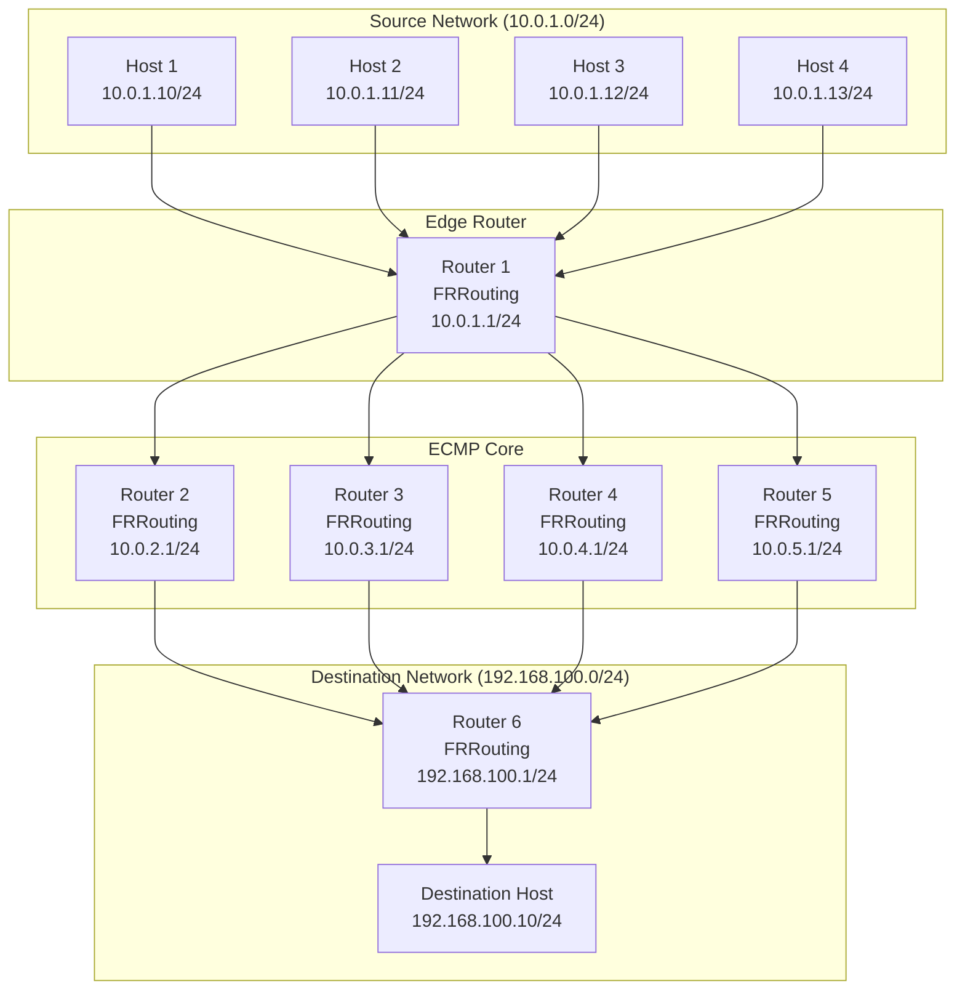

# ECMP Hash Testing - Test Report Template

## Document Information

| Field | Value |
|-------|-------|
| **Document Title** | ECMP Hash Testing - Test Report |
| **Document Version** | 1.0 |
| **Document Date** | [DATE] |
| **Document Status** | [DRAFT/FINAL] |
| **Project Name** | ECMP Hash Testing Framework |
| **Test Manager** | [NAME] |
| **Test Period** | [START DATE] to [END DATE] |
| **Standards Compliance** | ISO/IEC/IEEE 29119-3, IEEE 829 |

---

## Table of Contents
1. [Executive Summary](#executive-summary)
2. [Test Summary](#test-summary)
3. [Test Environment](#test-environment)
4. [Test Results](#test-results)
5. [Detailed Test Results](#detailed-test-results)
6. [Defects and Issues](#defects-and-issues)
7. [Statistical Analysis](#statistical-analysis)
8. [Performance Analysis](#performance-analysis)
9. [Recommendations](#recommendations)
10. [Conclusion](#conclusion)
11. [Appendices](#appendices)

---

## 1. Executive Summary

### 1.1 Overview

This report provides a comprehensive summary of the ECMP (Equal-Cost Multi-Path) hash testing activities conducted from [START DATE] to [END DATE]. The testing validated the ECMP routing behavior using a hash algorithm based on Source IP address only.

### 1.2 Test Objectives

| Objective | Status | Result |
|-----------|--------|--------|
| Validate ECMP Configuration | [COMPLETED/IN PROGRESS] | [PASS/FAIL] |
| Verify Hash Distribution Uniformity | [COMPLETED/IN PROGRESS] | [PASS/FAIL] |
| Test Framework Functionality | [COMPLETED/IN PROGRESS] | [PASS/FAIL] |
| Ensure Reproducibility | [COMPLETED/IN PROGRESS] | [PASS/FAIL] |

### 1.3 Key Findings

- **Overall Test Status**: [PASS/FAIL/PARTIAL]
- **Test Coverage**: [X]%
- **Pass Rate**: [X]%
- **Critical Defects**: [X]
- **Major Defects**: [X]
- **Minor Defects**: [X]

### 1.4 Recommendations

1. [Recommendation 1]
2. [Recommendation 2]
3. [Recommendation 3]

---

## 2. Test Summary

### 2.1 Test Execution Summary

| Metric | Value |
|--------|-------|
| Test Period | [START DATE] to [END DATE] |
| Total Test Cases | [X] |
| Test Cases Executed | [X] |
| Test Cases Passed | [X] |
| Test Cases Failed | [X] |
| Test Cases Blocked | [X] |
| Test Cases Skipped | [X] |
| Pass Rate | [X]% |
| Test Coverage | [X]% |
| Total Execution Time | [X] hours |

### 2.2 Test Execution Timeline

```mermaid
gantt
    title Test Execution Timeline
    dateFormat  YYYY-MM-DD
    section Planning
    Test Planning           :done, plan, [START DATE], [DURATION]
    section Preparation
    Environment Setup       :done, prep, after plan, [DURATION]
    section Execution
    Functional Testing      :active, func, after prep, [DURATION]
    Statistical Testing     :stat, after func, [DURATION]
    Performance Testing     :perf, after stat, [DURATION]
    Integration Testing     :integ, after perf, [DURATION]
    section Reporting
    Analysis and Reporting  :rep, after integ, [DURATION]
```

### 2.3 Test Scope

#### 2.3.1 In-Scope Items

- [ ] ECMP route configuration
- [ ] Hash policy configuration
- [ ] Traffic generation
- [ ] Traffic capture
- [ ] Result analysis
- [ ] Report generation
- [ ] Statistical validation
- [ ] Performance measurement

#### 2.3.2 Out-of-Scope Items

- [ ] Production network environments
- [ ] Hardware-specific implementations
- [ ] Vendor-specific ECMP implementations
- [ ] Security vulnerabilities
- [ ] IPv6 ECMP

### 2.4 Test Approach

The testing approach followed the ISO/IEC/IEEE 29119-3 standard and included:

1. **Functional Testing**: Validated ECMP routing behavior
2. **Statistical Testing**: Verified hash distribution uniformity
3. **Performance Testing**: Measured throughput and latency
4. **Integration Testing**: Validated component interactions

---

## 3. Test Environment

### 3.1 Environment Overview

| Environment | Type | Status | Purpose |
|-------------|------|--------|---------|
| Test Environment | Containerlab | [READY/NOT READY] | Primary testing |
| Backup Environment | Containerlab | [READY/NOT READY] | Backup testing |

### 3.2 Hardware Configuration

| Component | Specification | Quantity |
|-----------|---------------|----------|
| CPU | [X] cores | [X] |
| RAM | [X] GB | [X] |
| Disk Space | [X] GB | [X] |
| Network | [X] Gbps | [X] |

### 3.3 Software Configuration

| Software | Version | Purpose |
|----------|---------|---------|
| Docker | [X.X.X] | Container runtime |
| Containerlab | [X.X.X] | Topology emulation |
| FRRouting | [X.X.X] | Routing protocols |
| tcpdump | [X.X.X] | Packet capture |
| hping3 | [X.X.X] | Traffic generation |
| Allure | [X.X.X] | Test reporting |
| Python | [X.X.X] | Analysis scripts |
| Bash | [X.X.X] | Script execution |

### 3.4 Network Topology



### 3.5 Configuration Details

#### 3.5.1 ECMP Configuration

| Parameter | Value | Status |
|-----------|-------|--------|
| ECMP Paths | 4 | [CONFIGURED/NOT CONFIGURED] |
| Hash Policy | 1 (Source IP only) | [CONFIGURED/NOT CONFIGURED] |
| Route Metric | 100 | [CONFIGURED/NOT CONFIGURED] |
| OSPF Area | 0.0.0.0 | [CONFIGURED/NOT CONFIGURED] |

#### 3.5.2 Network Configuration

| Network | Purpose | IP Range | Gateway |
|---------|---------|----------|---------|
| 10.0.1.0/24 | Source Network | 10.0.1.0-10.0.1.255 | 10.0.1.1 |
| 10.0.2.0/24 | ECMP Path 1 | 10.0.2.0-10.0.2.255 | 10.0.2.1 |
| 10.0.3.0/24 | ECMP Path 2 | 10.0.3.0-10.0.3.255 | 10.0.3.1 |
| 10.0.4.0/24 | ECMP Path 3 | 10.0.4.0-10.0.4.255 | 10.0.4.1 |
| 10.0.5.0/24 | ECMP Path 4 | 10.0.5.0-10.0.5.255 | 10.0.5.1 |
| 192.168.100.0/24 | Destination Network | 192.168.100.0-192.168.100.255 | 192.168.100.1 |

---

## 4. Test Results

### 4.1 Overall Test Results

| Test Type | Total | Passed | Failed | Blocked | Skipped | Pass Rate |
|-----------|-------|--------|--------|---------|---------|-----------|
| Functional | [X] | [X] | [X] | [X] | [X] | [X]% |
| Statistical | [X] | [X] | [X] | [X] | [X] | [X]% |
| Performance | [X] | [X] | [X] | [X] | [X] | [X]% |
| Integration | [X] | [X] | [X] | [X] | [X] | [X]% |
| **Total** | **[X]** | **[X]** | **[X]** | **[X]** | **[X]** | **[X]%** |

### 4.2 Test Results by Priority

| Priority | Total | Passed | Failed | Blocked | Skipped | Pass Rate |
|----------|-------|--------|--------|---------|---------|-----------|
| High | [X] | [X] | [X] | [X] | [X] | [X]% |
| Medium | [X] | [X] | [X] | [X] | [X] | [X]% |
| Low | [X] | [X] | [X] | [X] | [X] | [X]% |

### 4.3 Test Results Summary Chart


### 4.4 Test Execution Details

| Test Case ID | Title | Type | Priority | Status | Execution Time | Result |
|--------------|-------|------|----------|--------|----------------|--------|
| TC-FUNC-001 | Deploy Topology | Functional | High | [PASS/FAIL] | [X] min | [PASS/FAIL] |
| TC-FUNC-002 | Configure ECMP | Functional | High | [PASS/FAIL] | [X] min | [PASS/FAIL] |
| TC-FUNC-003 | Generate Traffic | Functional | High | [PASS/FAIL] | [X] min | [PASS/FAIL] |
| TC-FUNC-004 | Capture Traffic | Functional | High | [PASS/FAIL] | [X] min | [PASS/FAIL] |
| TC-FUNC-005 | Analyze Results | Functional | High | [PASS/FAIL] | [X] min | [PASS/FAIL] |
| TC-FUNC-006 | Generate Report | Functional | Medium | [PASS/FAIL] | [X] min | [PASS/FAIL] |
| TC-STAT-001 | Validate Uniform Distribution | Statistical | High | [PASS/FAIL] | [X] min | [PASS/FAIL] |
| TC-STAT-002 | Calculate Entropy | Statistical | High | [PASS/FAIL] | [X] min | [PASS/FAIL] |
| TC-STAT-003 | Statistical Significance | Statistical | High | [PASS/FAIL] | [X] min | [PASS/FAIL] |
| TC-PERF-001 | Measure Throughput | Performance | Medium | [PASS/FAIL] | [X] min | [PASS/FAIL] |
| TC-PERF-002 | Measure Latency | Performance | Medium | [PASS/FAIL] | [X] min | [PASS/FAIL] |
| TC-PERF-003 | Resource Utilization | Performance | Medium | [PASS/FAIL] | [X] min | [PASS/FAIL] |
| TC-INT-001 | End-to-End Test | Integration | High | [PASS/FAIL] | [X] min | [PASS/FAIL] |
| TC-INT-002 | Error Handling | Integration | Medium | [PASS/FAIL] | [X] min | [PASS/FAIL] |
| TC-INT-003 | CI/CD Integration | Integration | Low | [PASS/FAIL] | [X] min | [PASS/FAIL] |

---

## 5. Detailed Test Results

### 5.1 Functional Test Results

#### TC-FUNC-001: Deploy Topology

| Field | Value |
|-------|-------|
| Test Case ID | TC-FUNC-001 |
| Title | Deploy ECMP Topology |
| Status | [PASS/FAIL] |
| Execution Time | [X] minutes |
| Tester | [NAME] |
| Execution Date | [DATE] |

**Test Steps:**
1. Execute `./scripts/deploy_topology.sh`
2. Wait for deployment to complete
3. Verify all containers are running
4. Check container status

**Expected Result:** All 11 containers running with no errors

**Actual Result:** [DESCRIPTION]

**Observations:**
- [Observation 1]
- [Observation 2]

**Evidence:**
- Container status output
- Deployment logs
- Screenshots (if applicable)

#### TC-FUNC-002: Configure ECMP

| Field | Value |
|-------|-------|
| Test Case ID | TC-FUNC-002 |
| Title | Configure ECMP Routing |
| Status | [PASS/FAIL] |
| Execution Time | [X] minutes |
| Tester | [NAME] |
| Execution Date | [DATE] |

**Test Steps:**
1. Execute `./scripts/configure_ecmp.sh`
2. Verify ECMP routes on edge router
3. Verify hash policy configuration
4. Check OSPF neighbors

**Expected Result:** 4 equal-cost routes, hash policy = 1, OSPF neighbors established

**Actual Result:** [DESCRIPTION]

**Observations:**
- [Observation 1]
- [Observation 2]

**Evidence:**
- Route table output
- Hash policy output
- OSPF neighbor output

#### TC-FUNC-003: Generate Traffic

| Field | Value |
|-------|-------|
| Test Case ID | TC-FUNC-003 |
| Title | Generate Test Traffic |
| Status | [PASS/FAIL] |
| Execution Time | [X] minutes |
| Tester | [NAME] |
| Execution Date | [DATE] |

**Test Steps:**
1. Execute `./scripts/generate_traffic.sh`
2. Verify traffic from all hosts
3. Check packet counts
4. Validate Source IP variation

**Expected Result:** Traffic generated from all 4 hosts with varying Source IPs

**Actual Result:** [DESCRIPTION]

**Observations:**
- [Observation 1]
- [Observation 2]

**Evidence:**
- Traffic generation logs
- Packet counts
- Source IP list

#### TC-FUNC-004: Capture Traffic

| Field | Value |
|-------|-------|
| Test Case ID | TC-FUNC-004 |
| Title | Capture Traffic on ECMP Paths |
| Status | [PASS/FAIL] |
| Execution Time | [X] minutes |
| Tester | [NAME] |
| Execution Date | [DATE] |

**Test Steps:**
1. Execute `./scripts/capture_traffic.sh`
2. Verify captures on all paths
3. Check capture file sizes
4. Validate capture synchronization

**Expected Result:** Captures on all 4 paths with similar file sizes

**Actual Result:** [DESCRIPTION]

**Observations:**
- [Observation 1]
- [Observation 2]

**Evidence:**
- Capture file list
- File sizes
- Capture logs

#### TC-FUNC-005: Analyze Results

| Field | Value |
|-------|-------|
| Test Case ID | TC-FUNC-005 |
| Title | Analyze Captured Traffic |
| Status | [PASS/FAIL] |
| Execution Time | [X] minutes |
| Tester | [NAME] |
| Execution Date | [DATE] |

**Test Steps:**
1. Execute `./scripts/analyze_results.sh`
2. Verify packet counts per path
3. Check distribution percentages
4. Validate statistical metrics

**Expected Result:** Correct packet counts, distribution percentages, and statistical metrics

**Actual Result:** [DESCRIPTION]

**Observations:**
- [Observation 1]
- [Observation 2]

**Evidence:**
- Analysis output
- Distribution metrics
- Statistical results

#### TC-FUNC-006: Generate Report

| Field | Value |
|-------|-------|
| Test Case ID | TC-FUNC-006 |
| Title | Generate Allure Report |
| Status | [PASS/FAIL] |
| Execution Time | [X] minutes |
| Tester | [NAME] |
| Execution Date | [DATE] |

**Test Steps:**
1. Execute `./scripts/generate_allure_report.sh`
2. Verify report generation
3. Check report contents
4. Validate visualizations

**Expected Result:** Allure report generated with all test results and visualizations

**Actual Result:** [DESCRIPTION]

**Observations:**
- [Observation 1]
- [Observation 2]

**Evidence:**
- Report URL
- Report screenshots
- Report contents

### 5.2 Statistical Test Results

#### TC-STAT-001: Validate Uniform Distribution

| Field | Value |
|-------|-------|
| Test Case ID | TC-STAT-001 |
| Title | Validate Uniform Distribution |
| Status | [PASS/FAIL] |
| Execution Time | [X] minutes |
| Tester | [NAME] |
| Execution Date | [DATE] |

**Test Steps:**
1. Review distribution percentages
2. Check deviation from expected
3. Verify chi-square test
4. Validate p-value

**Expected Result:** Distribution uniform (p > 0.05), deviation < 5%

**Actual Result:** [DESCRIPTION]

**Observations:**
- [Observation 1]
- [Observation 2]

**Evidence:**
- Distribution percentages
- Chi-square test results
- p-value

#### TC-STAT-002: Calculate Entropy

| Field | Value |
|-------|-------|
| Test Case ID | TC-STAT-002 |
| Title | Calculate Entropy |
| Status | [PASS/FAIL] |
| Execution Time | [X] minutes |
| Tester | [NAME] |
| Execution Date | [DATE] |

**Test Steps:**
1. Review entropy value
2. Compare with maximum entropy
3. Calculate entropy ratio
4. Validate hash quality

**Expected Result:** Entropy ≥ 0.9 × maximum, hash quality = Excellent/Good

**Actual Result:** [DESCRIPTION]

**Observations:**
- [Observation 1]
- [Observation 2]

**Evidence:**
- Entropy value
- Maximum entropy
- Hash quality assessment

#### TC-STAT-003: Statistical Significance

| Field | Value |
|-------|-------|
| Test Case ID | TC-STAT-003 |
| Title | Validate Statistical Significance |
| Status | [PASS/FAIL] |
| Execution Time | [X] minutes |
| Tester | [NAME] |
| Execution Date | [DATE] |

**Test Steps:**
1. Review sample size
2. Check confidence level
3. Verify statistical tests
4. Validate significance

**Expected Result:** Sample size ≥ 1000, confidence level ≥ 95%

**Actual Result:** [DESCRIPTION]

**Observations:**
- [Observation 1]
- [Observation 2]

**Evidence:**
- Sample size
- Confidence level
- Statistical test results

### 5.3 Performance Test Results

#### TC-PERF-001: Measure Throughput

| Field | Value |
|-------|-------|
| Test Case ID | TC-PERF-001 |
| Title | Measure Throughput |
| Status | [PASS/FAIL] |
| Execution Time | [X] minutes |
| Tester | [NAME] |
| Execution Date | [DATE] |

**Test Steps:**
1. Generate high-volume traffic
2. Measure packets per second
3. Calculate throughput
4. Compare with baseline

**Expected Result:** Throughput ≥ 1000 packets/second

**Actual Result:** [DESCRIPTION]

**Observations:**
- [Observation 1]
- [Observation 2]

**Evidence:**
- Throughput measurements
- Baseline comparison
- Performance charts

#### TC-PERF-002: Measure Latency

| Field | Value |
|-------|-------|
| Test Case ID | TC-PERF-002 |
| Title | Measure Latency |
| Status | [PASS/FAIL] |
| Execution Time | [X] minutes |
| Tester | [NAME] |
| Execution Date | [DATE] |

**Test Steps:**
1. Generate traffic with timestamps
2. Measure round-trip time
3. Calculate average latency
4. Compare with baseline

**Expected Result:** Latency < 10ms

**Actual Result:** [DESCRIPTION]

**Observations:**
- [Observation 1]
- [Observation 2]

**Evidence:**
- Latency measurements
- Baseline comparison
- Latency charts

#### TC-PERF-003: Resource Utilization

| Field | Value |
|-------|-------|
| Test Case ID | TC-PERF-003 |
| Title | Measure Resource Utilization |
| Status | [PASS/FAIL] |
| Execution Time | [X] minutes |
| Tester | [NAME] |
| Execution Date | [DATE] |

**Test Steps:**
1. Monitor CPU usage
2. Monitor memory usage
3. Monitor network usage
4. Calculate utilization percentages

**Expected Result:** Resource utilization < 80%

**Actual Result:** [DESCRIPTION]

**Observations:**
- [Observation 1]
- [Observation 2]

**Evidence:**
- CPU utilization
- Memory utilization
- Network utilization

### 5.4 Integration Test Results

#### TC-INT-001: End-to-End Test

| Field | Value |
|-------|-------|
| Test Case ID | TC-INT-001 |
| Title | End-to-End Test |
| Status | [PASS/FAIL] |
| Execution Time | [X] minutes |
| Tester | [NAME] |
| Execution Date | [DATE] |

**Test Steps:**
1. Deploy topology
2. Configure ECMP
3. Run test
4. Analyze results
5. Generate report

**Expected Result:** All steps complete successfully with valid results

**Actual Result:** [DESCRIPTION]

**Observations:**
- [Observation 1]
- [Observation 2]

**Evidence:**
- End-to-end logs
- Test results
- Report output

#### TC-INT-002: Error Handling

| Field | Value |
|-------|-------|
| Test Case ID | TC-INT-002 |
| Title | Error Handling |
| Status | [PASS/FAIL] |
| Execution Time | [X] minutes |
| Tester | [NAME] |
| Execution Date | [DATE] |

**Test Steps:**
1. Inject error (e.g., stop container)
2. Verify error detection
3. Verify error logging
4. Verify graceful degradation

**Expected Result:** Errors detected, logged, and handled gracefully

**Actual Result:** [DESCRIPTION]

**Observations:**
- [Observation 1]
- [Observation 2]

**Evidence:**
- Error logs
- System behavior
- Recovery steps

#### TC-INT-003: CI/CD Integration

| Field | Value |
|-------|-------|
| Test Case ID | TC-INT-003 |
| Title | CI/CD Integration |
| Status | [PASS/FAIL] |
| Execution Time | [X] minutes |
| Tester | [NAME] |
| Execution Date | [DATE] |

**Test Steps:**
1. Trigger CI/CD pipeline
2. Verify test execution
3. Check exit codes
4. Verify artifact upload

**Expected Result:** Pipeline executes successfully with correct exit codes and artifacts

**Actual Result:** [DESCRIPTION]

**Observations:**
- [Observation 1]
- [Observation 2]

**Evidence:**
- CI/CD logs
- Exit codes
- Artifacts

---

## 6. Defects and Issues

### 6.1 Defect Summary

| Severity | Open | Closed | Total |
|----------|------|--------|-------|
| Critical | [X] | [X] | [X] |
| Major | [X] | [X] | [X] |
| Minor | [X] | [X] | [X] |
| Trivial | [X] | [X] | [X] |
| **Total** | **[X]** | **[X]** | **[X]** |

### 6.2 Defect Details

#### DEF-001: [Defect Title]

| Field | Value |
|-------|-------|
| Defect ID | DEF-001 |
| Title | [Defect Title] |
| Severity | [Critical/Major/Minor/Trivial] |
| Priority | [High/Medium/Low] |
| Status | [Open/In Progress/Fixed/Closed] |
| Discovered By | [NAME] |
| Discovery Date | [DATE] |
| Assigned To | [NAME] |
| Fixed By | [NAME] |
| Fix Date | [DATE] |

**Description:**
[Detailed description of the defect]

**Steps to Reproduce:**
1. [Step 1]
2. [Step 2]
3. [Step 3]

**Expected Result:**
[Expected behavior]

**Actual Result:**
[Actual behavior]

**Root Cause:**
[Root cause analysis]

**Fix:**
[Description of fix]

**Verification:**
[Verification steps and results]

**Evidence:**
- [Screenshot 1]
- [Log file 1]
- [Other evidence]

#### DEF-002: [Defect Title]

| Field | Value |
|-------|-------|
| Defect ID | DEF-002 |
| Title | [Defect Title] |
| Severity | [Critical/Major/Minor/Trivial] |
| Priority | [High/Medium/Low] |
| Status | [Open/In Progress/Fixed/Closed] |
| Discovered By | [NAME] |
| Discovery Date | [DATE] |
| Assigned To | [NAME] |
| Fixed By | [NAME] |
| Fix Date | [DATE] |

**Description:**
[Detailed description of the defect]

**Steps to Reproduce:**
1. [Step 1]
2. [Step 2]
3. [Step 3]

**Expected Result:**
[Expected behavior]

**Actual Result:**
[Actual behavior]

**Root Cause:**
[Root cause analysis]

**Fix:**
[Description of fix]

**Verification:**
[Verification steps and results]

**Evidence:**
- [Screenshot 1]
- [Log file 1]
- [Other evidence]

### 6.3 Issues and Concerns

| Issue ID | Title | Severity | Status | Description |
|----------|-------|----------|--------|-------------|
| ISS-001 | [Issue Title] | [High/Medium/Low] | [Open/Closed] | [Description] |
| ISS-002 | [Issue Title] | [High/Medium/Low] | [Open/Closed] | [Description] |

---

## 7. Statistical Analysis

### 7.1 Distribution Analysis

#### 7.1.1 Packet Distribution

| Path | Router | Packets | Percentage | Expected | Deviation |
|------|--------|---------|------------|----------|-----------|
| Path 1 | r2 | [X] | [X]% | [X] | [X]% |
| Path 2 | r3 | [X] | [X]% | [X] | [X]% |
| Path 3 | r4 | [X] | [X]% | [X] | [X]% |
| Path 4 | r5 | [X] | [X]% | [X] | [X]% |
| **Total** | - | **[X]** | **100%** | **[X]** | **[X]%** |

#### 7.1.2 Distribution Chart


### 7.2 Chi-Square Test

| Metric | Value |
|--------|-------|
| Chi-Square (χ²) | [X.XX] |
| Degrees of Freedom | [X] |
| p-value | [X.XX] |
| Critical Value (α=0.05) | [X.XX] |
| Result | [PASS/FAIL] |

**Interpretation:**
- [Interpretation of chi-square test results]
- [Conclusion about distribution uniformity]

### 7.3 Entropy Analysis

| Metric | Value |
|--------|-------|
| Entropy (H) | [X.XX] bits |
| Maximum Entropy (H_max) | [X.XX] bits |
| Entropy Ratio (H/H_max) | [X.XX] |
| Hash Quality | [Excellent/Good/Fair/Poor] |

**Interpretation:**
- [Interpretation of entropy results]
- [Conclusion about hash randomness]

### 7.4 Statistical Significance

| Metric | Value |
|--------|-------|
| Sample Size | [X] packets |
| Packets per Path | [X] packets |
| Confidence Level | [X]% |
| Significance Level (α) | [X.XX] |
| Result | [PASS/FAIL] |

**Interpretation:**
- [Interpretation of statistical significance]
- [Conclusion about result reliability]

### 7.5 Trend Analysis

| Test Run | Date | χ² | p-value | Entropy | Result |
|----------|------|-----|---------|---------|--------|
| Run 1 | [DATE] | [X.XX] | [X.XX] | [X.XX] | [PASS/FAIL] |
| Run 2 | [DATE] | [X.XX] | [X.XX] | [X.XX] | [PASS/FAIL] |
| Run 3 | [DATE] | [X.XX] | [X.XX] | [X.XX] | [PASS/FAIL] |

**Trend Analysis:**
- [Analysis of trends over time]
- [Identification of patterns or anomalies]

---

## 8. Performance Analysis

### 8.1 Throughput Analysis

| Metric | Value | Target | Status |
|--------|-------|--------|--------|
| Throughput | [X] packets/second | ≥ 1000 | [PASS/FAIL] |
| Peak Throughput | [X] packets/second | ≥ 1000 | [PASS/FAIL] |
| Average Throughput | [X] packets/second | ≥ 1000 | [PASS/FAIL] |

**Analysis:**
- [Analysis of throughput results]
- [Comparison with baseline]
- [Identification of bottlenecks]

### 8.2 Latency Analysis

| Metric | Value | Target | Status |
|--------|-------|--------|--------|
| Average Latency | [X] ms | < 10 | [PASS/FAIL] |
| Minimum Latency | [X] ms | < 10 | [PASS/FAIL] |
| Maximum Latency | [X] ms | < 10 | [PASS/FAIL] |
| Standard Deviation | [X] ms | < 5 | [PASS/FAIL] |

**Analysis:**
- [Analysis of latency results]
- [Comparison with baseline]
- [Identification of latency issues]

### 8.3 Resource Utilization

| Resource | Average | Peak | Target | Status |
|----------|---------|------|--------|--------|
| CPU | [X]% | [X]% | < 80% | [PASS/FAIL] |
| Memory | [X]% | [X]% | < 80% | [PASS/FAIL] |
| Network | [X]% | [X]% | < 80% | [PASS/FAIL] |
| Disk I/O | [X]% | [X]% | < 80% | [PASS/FAIL] |

**Analysis:**
- [Analysis of resource utilization]
- [Identification of resource constraints]
- [Recommendations for optimization]

### 8.4 Scalability Analysis

| Metric | Low Volume | Medium Volume | High Volume | Trend |
|--------|------------|---------------|-------------|-------|
| Throughput | [X] pps | [X] pps | [X] pps | [Increasing/Stable/Decreasing] |
| Latency | [X] ms | [X] ms | [X] ms | [Increasing/Stable/Decreasing] |
| CPU Usage | [X]% | [X]% | [X]% | [Increasing/Stable/Decreasing] |

**Analysis:**
- [Analysis of scalability results]
- [Identification of scalability limits]
- [Recommendations for scaling]

---

## 9. Recommendations

### 9.1 System Recommendations

#### 9.1.1 Configuration Improvements

1. **Recommendation 1**
   - **Issue:** [Description of issue]
   - **Recommendation:** [Specific recommendation]
   - **Priority:** [High/Medium/Low]
   - **Impact:** [Expected impact]

2. **Recommendation 2**
   - **Issue:** [Description of issue]
   - **Recommendation:** [Specific recommendation]
   - **Priority:** [High/Medium/Low]
   - **Impact:** [Expected impact]

#### 9.1.2 Performance Optimizations

1. **Recommendation 1**
   - **Issue:** [Description of issue]
   - **Recommendation:** [Specific recommendation]
   - **Priority:** [High/Medium/Low]
   - **Impact:** [Expected impact]

2. **Recommendation 2**
   - **Issue:** [Description of issue]
   - **Recommendation:** [Specific recommendation]
   - **Priority:** [High/Medium/Low]
   - **Impact:** [Expected impact]

### 9.2 Process Recommendations

#### 9.2.1 Testing Process Improvements

1. **Recommendation 1**
   - **Issue:** [Description of issue]
   - **Recommendation:** [Specific recommendation]
   - **Priority:** [High/Medium/Low]
   - **Impact:** [Expected impact]

2. **Recommendation 2**
   - **Issue:** [Description of issue]
   - **Recommendation:** [Specific recommendation]
   - **Priority:** [High/Medium/Low]
   - **Impact:** [Expected impact]

#### 9.2.2 Documentation Improvements

1. **Recommendation 1**
   - **Issue:** [Description of issue]
   - **Recommendation:** [Specific recommendation]
   - **Priority:** [High/Medium/Low]
   - **Impact:** [Expected impact]

2. **Recommendation 2**
   - **Issue:** [Description of issue]
   - **Recommendation:** [Specific recommendation]
   - **Priority:** [High/Medium/Low]
   - **Impact:** [Expected impact]

### 9.3 Future Work

#### 9.3.1 Additional Testing

1. **Test 1**
   - **Description:** [Description of test]
   - **Priority:** [High/Medium/Low]
   - **Estimated Effort:** [X] hours

2. **Test 2**
   - **Description:** [Description of test]
   - **Priority:** [High/Medium/Low]
   - **Estimated Effort:** [X] hours

#### 9.3.2 Feature Enhancements

1. **Enhancement 1**
   - **Description:** [Description of enhancement]
   - **Priority:** [High/Medium/Low]
   - **Estimated Effort:** [X] hours

2. **Enhancement 2**
   - **Description:** [Description of enhancement]
   - **Priority:** [High/Medium/Low]
   - **Estimated Effort:** [X] hours

---

## 10. Conclusion

### 10.1 Test Summary

The ECMP hash testing was conducted from [START DATE] to [END DATE] to validate the ECMP routing behavior using a hash algorithm based on Source IP address only.

**Overall Test Status:** [PASS/FAIL/PARTIAL]

**Key Achievements:**
- [Achievement 1]
- [Achievement 2]
- [Achievement 3]

**Key Challenges:**
- [Challenge 1]
- [Challenge 2]
- [Challenge 3]

### 10.2 Test Objectives Status

| Objective | Status | Result |
|-----------|--------|--------|
| Validate ECMP Configuration | [COMPLETED/IN PROGRESS] | [PASS/FAIL] |
| Verify Hash Distribution Uniformity | [COMPLETED/IN PROGRESS] | [PASS/FAIL] |
| Test Framework Functionality | [COMPLETED/IN PROGRESS] | [PASS/FAIL] |
| Ensure Reproducibility | [COMPLETED/IN PROGRESS] | [PASS/FAIL] |

### 10.3 Final Assessment

The ECMP hash testing framework [successfully/partially/failed to] validate the ECMP routing behavior. The test results indicate that [summary of findings].

**Production Readiness:** [READY/NOT READY/CONDITIONALLY READY]

**Recommendation:** [Recommendation for production deployment]

### 10.4 Sign-Off

| Role | Name | Signature | Date |
|------|------|-----------|------|
| Test Manager | [NAME] | _________________ | [DATE] |
| Project Manager | [NAME] | _________________ | [DATE] |
| Quality Assurance | [NAME] | _________________ | [DATE] |
| Network Engineer | [NAME] | _________________ | [DATE] |

---

## 11. Appendices

### Appendix A: Test Execution Logs

#### A.1 Deployment Logs

```
[LOG CONTENT]
```

#### A.2 Configuration Logs

```
[LOG CONTENT]
```

#### A.3 Test Execution Logs

```
[LOG CONTENT]
```

### Appendix B: Test Data

#### B.1 Traffic Configuration

```yaml
[TRAFFIC CONFIGURATION]
```

#### B.2 Capture Files

| File | Size | Packets | Duration |
|------|------|---------|----------|
| [File 1] | [X] MB | [X] | [X] s |
| [File 2] | [X] MB | [X] | [X] s |
| [File 3] | [X] MB | [X] | [X] s |
| [File 4] | [X] MB | [X] | [X] s |

### Appendix C: Statistical Calculations

#### C.1 Chi-Square Calculation

```
[CALCULATION DETAILS]
```

#### C.2 Entropy Calculation

```
[CALCULATION DETAILS]
```

### Appendix D: Performance Metrics

#### D.1 Throughput Measurements

| Time | Throughput |
|------|------------|
| [T1] | [X] pps |
| [T2] | [X] pps |
| [T3] | [X] pps |

#### D.2 Latency Measurements

| Time | Latency |
|------|---------|
| [T1] | [X] ms |
| [T2] | [X] ms |
| [T3] | [X] ms |

### Appendix E: Allure Report

**Report URL:** [URL]

**Report Screenshots:**
- [Screenshot 1]
- [Screenshot 2]
- [Screenshot 3]

### Appendix F: Glossary

| Term | Definition |
|------|------------|
| ECMP | Equal-Cost Multi-Path routing |
| FRR | FRRouting routing protocol suite |
| BPF | Berkeley Packet Filter |
| CI/CD | Continuous Integration/Continuous Deployment |
| RFC | Request for Comments (IETF standards) |
| ISO | International Organization for Standardization |
| IEEE | Institute of Electrical and Electronics Engineers |
| Chi-Square Test | Statistical test for distribution uniformity |
| Entropy | Measure of randomness in information theory |
| p-value | Probability of observing results if null hypothesis is true |
| Confidence Level | Probability that results are within a specified range |
| Significance Level | Threshold for rejecting null hypothesis |

### Appendix G: References

| Reference | Title | URL |
|-----------|-------|-----|
| ISO/IEC/IEEE 29119-3 | Software testing documentation | https://www.iso.org/standard/65274.html |
| IEEE 829 | Standard for Software Test Documentation | https://standards.ieee.org/standard/829-2008.html |
| RFC 2992 | Analysis of an Equal-Cost Multi-Path Algorithm | https://tools.ietf.org/html/rfc2992 |
| RFC 791 | Internet Protocol | https://tools.ietf.org/html/rfc791 |
| RFC 2544 | Benchmarking Methodology for Network Interconnect Devices | https://tools.ietf.org/html/rfc2544 |
| RFC 2330 | Framework for IP Performance Metrics | https://tools.ietf.org/html/rfc2330 |

---

**Document Version:** 1.0  
**Last Updated:** [DATE]  
**Next Review Date:** [DATE]  
**Maintainer:** [NAME]
