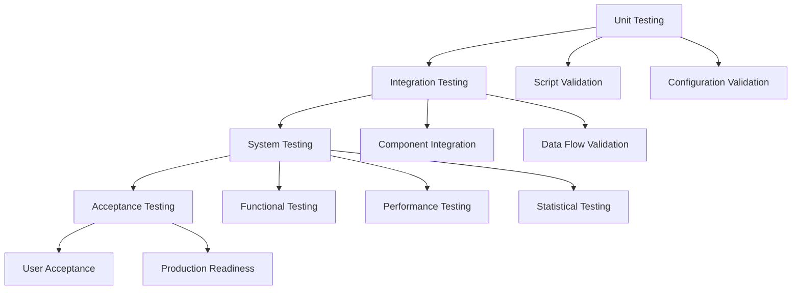
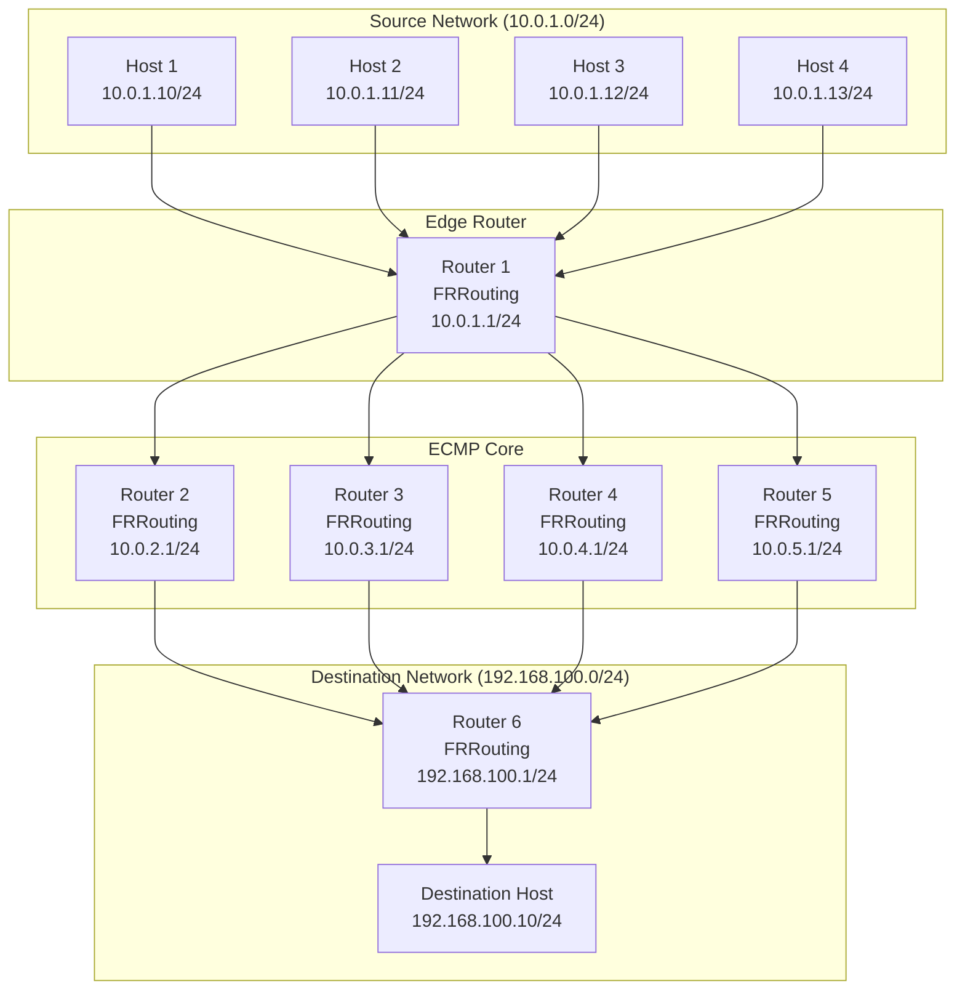

# ECMP Hash Validation - Test Design Specification

## Document Control

| Field | Value |
|-------|-------|
| **Document Title** | ECMP Hash Validation - Test Design Specification |
| **Document Identifier** | ISO29119-3-TDS-001 |
| **Document Version** | 1.0 |
| **Document Date** | 2026-03-06 |
| **Document Status** | Final |
| **Project Name** | ECMP Hash Testing Framework |
| **Test Designer** | ECMP Testing Team |
| **Approval Date** | 2026-03-06 |
| **Standards Compliance** | ISO/IEC/IEEE 29119-3:2013, IEEE 829-2008 |

### Version History

| Version | Date | Author | Description | Approval |
|---------|------|--------|-------------|-----------|
| 1.0 | 2026-03-06 | ECMP Testing Team | Initial release | Approved |

### Approval Signatures

| Role | Name | Signature | Date |
|------|------|-----------|------|
| Test Designer | ECMP Testing Team | __________________ | 2026-03-06 |
| Test Manager | __________________ | __________________ | _____________ |
| Project Manager | __________________ | __________________ | _____________ |
| Quality Assurance | __________________ | __________________ | _____________ |

### Distribution List

| Recipient | Role | Date Distributed |
|-----------|------|-----------------|
| Test Team | Test Engineers | 2026-03-06 |
| Project Management | Project Manager | 2026-03-06 |
| Quality Assurance | QA Team | 2026-03-06 |
| Network Engineering | Network Engineers | 2026-03-06 |

---

## Table of Contents

1. [Introduction](#1-introduction)
2. [Test Design Overview](#2-test-design-overview)
3. [Test Cases](#3-test-cases)
4. [Test Data](#4-test-data)
5. [Test Environment](#5-test-environment)
6. [References](#6-references)
7. [Appendices](#7-appendices)

---

## 1. Introduction

### 1.1 Purpose

This Test Design Specification provides detailed test cases, test data, and test environment configuration for validating ECMP (Equal-Cost Multi-Path) hash behavior. The purpose is to ensure comprehensive test coverage of ECMP routing functionality using a hash algorithm based on Source IP address only.

This document serves as the primary reference for test execution and ensures compliance with ISO/IEC/IEEE 29119-3 international standard for software testing documentation.

### 1.2 Scope

The test design covers:

- **Functional Test Cases**: Validation of ECMP configuration, traffic generation, and traffic capture
- **Statistical Test Cases**: Verification of hash distribution uniformity and statistical significance
- **Performance Test Cases**: Measurement of throughput, latency, and resource utilization
- **Integration Test Cases**: Validation of component interactions and end-to-end workflows

The test design is limited to:
- Containerlab-based isolated network topology
- IPv4 protocol only
- Source IP hash algorithm
- Maximum 4 ECMP paths
- Test scenarios defined in [`config/test_config.yaml`](../config/test_config.yaml)

### 1.3 References

| Reference | Title | URL |
|-----------|-------|-----|
| ISO/IEC/IEEE 29119-3:2013 | Software and systems engineering — Software testing — Part 3: Test documentation | https://www.iso.org/standard/65274.html |
| IEEE 829-2008 | IEEE Standard for Software Test Documentation | https://standards.ieee.org/standard/829-2008.html |
| RFC 2992 | Analysis of an Equal-Cost Multi-Path Algorithm | https://tools.ietf.org/html/rfc2992 |
| RFC 2991 | Multipath Issues in Unicast and Multicast Next-Hop Selection | https://tools.ietf.org/html/rfc2991 |
| RFC 791 | Internet Protocol | https://tools.ietf.org/html/rfc791 |
| RFC 2544 | Benchmarking Methodology for Network Interconnect Devices | https://tools.ietf.org/html/rfc2544 |
| RFC 2330 | Framework for IP Performance Metrics | https://tools.ietf.org/html/rfc2330 |
| Test Plan | ECMP Hash Validation - Test Plan | [`docs/iso29119-3/test_plan.md`](test_plan.md) |
| Master Test Configuration | Test Configuration | [`config/test_config.yaml`](../config/test_config.yaml) |

---

## 2. Test Design Overview

### 2.1 Test Strategy

The test strategy follows ISO/IEC/IEEE 29119-3 standard and includes:

#### 2.1.1 Test Levels

#### 2.1.2 Test Types

| Test Type | Purpose | Tools | Coverage |
|-----------|---------|-------|----------|
| Functional | Verify ECMP behavior | FRRouting, tcpdump | 100% |
| Statistical | Validate distribution | Python, R | 100% |
| Performance | Measure throughput/latency | hping3, ping | 80% |
| Integration | Verify component interaction | Containerlab | 100% |
| Regression | Detect regressions | CI/CD | 100% |
| Smoke | Quick validation | Bash scripts | 100% |

#### 2.1.3 Test Methods

1. **Black-Box Testing**
   - Test external behavior
   - Validate inputs and outputs
   - Verify functional requirements

2. **White-Box Testing**
   - Test internal logic
   - Validate code paths
   - Verify algorithms

3. **Gray-Box Testing**
   - Partial knowledge of internals
   - Validate interfaces
   - Verify data flow

### 2.2 Test Levels

| Test Level | Description | Test Cases | Priority |
|------------|-------------|-------------|----------|
| Unit Testing | Validate individual scripts and components | TC-FUNC-001 to TC-FUNC-006 | High |
| Integration Testing | Validate component interactions | TC-INT-001 to TC-INT-003 | High |
| System Testing | Validate complete system functionality | TC-FUNC-001 to TC-FUNC-006 | High |
| Acceptance Testing | Validate production readiness | TC-INT-001 | High |

### 2.3 Test Types

| Test Type | Description | Test Cases | Priority |
|-----------|-------------|-------------|----------|
| Functional | Validate ECMP functionality | TC-FUNC-001 to TC-FUNC-006 | High |
| Statistical | Validate distribution uniformity | TC-STAT-001 to TC-STAT-003 | High |
| Performance | Measure performance metrics | TC-PERF-001 to TC-PERF-003 | Medium |
| Integration | Validate component integration | TC-INT-001 to TC-INT-003 | High |

---

## 3. Test Cases

### 3.1 Test Case Template

| Field | Description |
|-------|-------------|
| Test Case ID | Unique identifier |
| Title | Brief description |
| Description | Detailed description |
| Pre-conditions | Required state before test |
| Test Steps | Step-by-step instructions |
| Expected Results | Expected outcome |
| Postconditions | State after test |
| Priority | High/Medium/Low |
| Test Data | Required test data |
| Dependencies | Other test cases or items |

### 3.2 Functional Test Cases

#### TC-FUNC-001: Deploy Topology

| Field | Value |
|-------|-------|
| Test Case ID | TC-FUNC-001 |
| Title | Deploy ECMP Topology |
| Description | Deploy the Containerlab topology and verify all containers are running |
| Pre-conditions | Docker and Containerlab installed |
| Test Steps | 1. Execute `./scripts/deploy_topology.sh` 2. Wait for deployment to complete 3. Verify all containers are running 4. Check container status |
| Expected Results | All 11 containers running with no errors |
| Postconditions | Topology deployed and ready for configuration |
| Priority | High |
| Test Data | Topology configuration file: [`topology/clab-ecmp-test.yml`](../topology/clab-ecmp-test.yml) |
| Dependencies | None |

#### TC-FUNC-002: Configure ECMP

| Field | Value |
|-------|-------|
| Test Case ID | TC-FUNC-002 |
| Title | Configure ECMP Routing |
| Description | Configure ECMP on all routers with Source IP hash policy |
| Pre-conditions | Topology deployed |
| Test Steps | 1. Execute `./scripts/configure_ecmp.sh` 2. Verify ECMP routes on edge router 3. Verify hash policy configuration 4. Check OSPF neighbors |
| Expected Results | 4 equal-cost routes, hash policy = 1, OSPF neighbors established |
| Postconditions | ECMP configured and ready for testing |
| Priority | High |
| Test Data | FRR configuration files in [`configs/frr/`](../configs/frr/) |
| Dependencies | TC-FUNC-001 |

#### TC-FUNC-003: Generate Traffic

| Field | Value |
|-------|-------|
| Test Case ID | TC-FUNC-003 |
| Title | Generate Test Traffic |
| Description | Generate traffic from source hosts with varying Source IPs |
| Pre-conditions | ECMP configured |
| Test Steps | 1. Execute `./scripts/generate_traffic.sh` 2. Verify traffic from all hosts 3. Check packet counts 4. Validate Source IP variation |
| Expected Results | Traffic generated from all 4 hosts with varying Source IPs |
| Postconditions | Traffic generated and ready for capture |
| Priority | High |
| Test Data | Traffic configuration: [`configs/traffic/traffic_config.yaml`](../configs/traffic/traffic_config.yaml) |
| Dependencies | TC-FUNC-002 |

#### TC-FUNC-004: Capture Traffic

| Field | Value |
|-------|-------|
| Test Case ID | TC-FUNC-004 |
| Title | Capture Traffic on ECMP Paths |
| Description | Capture traffic on all ECMP paths using tcpdump |
| Pre-conditions | Traffic generation started |
| Test Steps | 1. Execute `./scripts/capture_traffic.sh` 2. Verify captures on all paths 3. Check capture file sizes 4. Validate capture synchronization |
| Expected Results | Captures on all 4 paths with similar file sizes |
| Postconditions | Traffic captured and ready for analysis |
| Priority | High |
| Test Data | Capture configuration |
| Dependencies | TC-FUNC-003 |

#### TC-FUNC-005: Analyze Results

| Field | Value |
|-------|-------|
| Test Case ID | TC-FUNC-005 |
| Title | Analyze Captured Traffic |
| Description | Analyze captured traffic and calculate distribution metrics |
| Pre-conditions | Traffic captured |
| Test Steps | 1. Execute `./scripts/analyze_results.sh` 2. Verify packet counts per path 3. Check distribution percentages 4. Validate statistical metrics |
| Expected Results | Correct packet counts, distribution percentages, and statistical metrics |
| Postconditions | Analysis complete and ready for reporting |
| Priority | High |
| Test Data | Capture files in `results/captures/` |
| Dependencies | TC-FUNC-004 |

#### TC-FUNC-006: Generate Report

| Field | Value |
|-------|-------|
| Test Case ID | TC-FUNC-006 |
| Title | Generate Allure Report |
| Description | Generate Allure report with test results |
| Pre-conditions | Analysis completed |
| Test Steps | 1. Execute `./scripts/generate_allure_report.sh` 2. Verify report generation 3. Check report contents 4. Validate visualizations |
| Expected Results | Allure report generated with all test results and visualizations |
| Postconditions | Report generated and ready for review |
| Priority | Medium |
| Test Data | Analysis results in `results/analysis/` |
| Dependencies | TC-FUNC-005 |

### 3.3 Statistical Test Cases

#### TC-STAT-001: Validate Uniform Distribution

| Field | Value |
|-------|-------|
| Test Case ID | TC-STAT-001 |
| Title | Validate Uniform Distribution |
| Description | Validate that hash distribution is uniform across ECMP paths |
| Pre-conditions | Analysis completed |
| Test Steps | 1. Review distribution percentages 2. Check deviation from expected 3. Verify chi-square test 4. Validate p-value |
| Expected Results | Distribution uniform (p > 0.05), deviation < 5% |
| Postconditions | Distribution validated |
| Priority | High |
| Test Data | Analysis results |
| Dependencies | TC-FUNC-005 |

#### TC-STAT-002: Calculate Entropy

| Field | Value |
|-------|-------|
| Test Case ID | TC-STAT-002 |
| Title | Calculate Entropy |
| Description | Calculate entropy of hash distribution |
| Pre-conditions | Analysis completed |
| Test Steps | 1. Review entropy value 2. Compare with maximum entropy 3. Calculate entropy ratio 4. Validate hash quality |
| Expected Results | Entropy ≥ 0.9 × maximum, hash quality = Excellent/Good |
| Postconditions | Entropy calculated and validated |
| Priority | High |
| Test Data | Analysis results |
| Dependencies | TC-FUNC-005 |

#### TC-STAT-003: Statistical Significance

| Field | Value |
|-------|-------|
| Test Case ID | TC-STAT-003 |
| Title | Validate Statistical Significance |
| Description | Validate that results are statistically significant |
| Pre-conditions | Analysis completed |
| Test Steps | 1. Review sample size 2. Check confidence level 3. Verify statistical tests 4. Validate significance |
| Expected Results | Sample size ≥ 1000, confidence level ≥ 95% |
| Postconditions | Statistical significance validated |
| Priority | High |
| Test Data | Analysis results |
| Dependencies | TC-FUNC-005 |

### 3.4 Performance Test Cases

#### TC-PERF-001: Measure Throughput

| Field | Value |
|-------|-------|
| Test Case ID | TC-PERF-001 |
| Title | Measure Throughput |
| Description | Measure throughput of ECMP routing |
| Pre-conditions | ECMP configured |
| Test Steps | 1. Generate high-volume traffic 2. Measure packets per second 3. Calculate throughput 4. Compare with baseline |
| Expected Results | Throughput ≥ 1000 packets/second |
| Postconditions | Throughput measured |
| Priority | Medium |
| Test Data | High-volume traffic configuration |
| Dependencies | TC-FUNC-002 |

#### TC-PERF-002: Measure Latency

| Field | Value |
|-------|-------|
| Test Case ID | TC-PERF-002 |
| Title | Measure Latency |
| Description | Measure latency of ECMP routing |
| Pre-conditions | ECMP configured |
| Test Steps | 1. Generate traffic with timestamps 2. Measure round-trip time 3. Calculate average latency 4. Compare with baseline |
| Expected Results | Latency < 10ms |
| Postconditions | Latency measured |
| Priority | Medium |
| Test Data | Traffic with timestamps |
| Dependencies | TC-FUNC-002 |

#### TC-PERF-003: Resource Utilization

| Field | Value |
|-------|-------|
| Test Case ID | TC-PERF-003 |
| Title | Measure Resource Utilization |
| Description | Measure CPU, memory, and network utilization |
| Pre-conditions | ECMP configured |
| Test Steps | 1. Monitor CPU usage 2. Monitor memory usage 3. Monitor network usage 4. Calculate utilization percentages |
| Expected Results | Resource utilization < 80% |
| Postconditions | Resource utilization measured |
| Priority | Medium |
| Test Data | System metrics |
| Dependencies | TC-FUNC-002 |

### 3.5 Integration Test Cases

#### TC-INT-001: End-to-End Test

| Field | Value |
|-------|-------|
| Test Case ID | TC-INT-001 |
| Title | End-to-End Test |
| Description | Execute complete test workflow from deployment to reporting |
| Pre-conditions | Prerequisites installed |
| Test Steps | 1. Deploy topology 2. Configure ECMP 3. Run test 4. Analyze results 5. Generate report |
| Expected Results | All steps complete successfully with valid results |
| Postconditions | Complete test cycle executed |
| Priority | High |
| Test Data | Complete test configuration |
| Dependencies | None |

#### TC-INT-002: Error Handling

| Field | Value |
|-------|-------|
| Test Case ID | TC-INT-002 |
| Title | Error Handling |
| Description | Verify error handling and recovery mechanisms |
| Pre-conditions | Topology deployed |
| Test Steps | 1. Inject error (e.g., stop container) 2. Verify error detection 3. Verify error logging 4. Verify graceful degradation |
| Expected Results | Errors detected, logged, and handled gracefully |
| Postconditions | Error handling validated |
| Priority | Medium |
| Test Data | Error scenarios |
| Dependencies | TC-FUNC-001 |

#### TC-INT-003: CI/CD Integration

| Field | Value |
|-------|-------|
| Test Case ID | TC-INT-003 |
| Title | CI/CD Integration |
| Description | Validate CI/CD pipeline execution |
| Pre-conditions | CI/CD configured |
| Test Steps | 1. Trigger CI/CD pipeline 2. Verify test execution 3. Check exit codes 4. Verify artifact upload |
| Expected Results | Pipeline executes successfully with correct exit codes and artifacts |
| Postconditions | CI/CD integration validated |
| Priority | Low |
| Test Data | CI/CD configuration |
| Dependencies | None |

### 3.6 Scenario-Based Test Cases

#### TC-SCEN-001: Basic ECMP Distribution Test

| Field | Value |
|-------|-------|
| Test Case ID | TC-SCEN-001 |
| Title | Basic ECMP Distribution Test |
| Description | Test basic ECMP distribution with all source hosts |
| Pre-conditions | ECMP configured |
| Test Steps | 1. Generate traffic from all 4 source hosts 2. Capture traffic on all ECMP paths 3. Analyze distribution 4. Validate uniformity |
| Expected Results | Uniform distribution across all 4 paths |
| Postconditions | Distribution validated |
| Priority | High |
| Test Data | Sources: h1, h2, h3, h4; Duration: 60s; Packets per source: 1000 |
| Dependencies | TC-FUNC-002 |

#### TC-SCEN-002: Single Source Host Test

| Field | Value |
|-------|-------|
| Test Case ID | TC-SCEN-002 |
| Title | Single Source Host Test |
| Description | Test ECMP distribution with single source host |
| Pre-conditions | ECMP configured |
| Test Steps | 1. Generate traffic from single source host 2. Capture traffic on all ECMP paths 3. Analyze distribution 4. Validate uniformity |
| Expected Results | Uniform distribution across all 4 paths |
| Postconditions | Distribution validated |
| Priority | High |
| Test Data | Sources: h1; Duration: 30s; Packets per source: 1000 |
| Dependencies | TC-FUNC-002 |

#### TC-SCEN-003: High Volume Test

| Field | Value |
|-------|-------|
| Test Case ID | TC-SCEN-003 |
| Title | High Volume Test |
| Description | Test ECMP distribution with high traffic volume |
| Pre-conditions | ECMP configured |
| Test Steps | 1. Generate high-volume traffic from all hosts 2. Capture traffic on all ECMP paths 3. Analyze distribution 4. Validate uniformity |
| Expected Results | Uniform distribution with high statistical significance |
| Postconditions | Distribution validated |
| Priority | High |
| Test Data | Sources: h1, h2, h3, h4; Duration: 120s; Packets per source: 2500 |
| Dependencies | TC-FUNC-002 |

#### TC-SCEN-004: Burst Traffic Test

| Field | Value |
|-------|-------|
| Test Case ID | TC-SCEN-004 |
| Title | Burst Traffic Test |
| Description | Test ECMP distribution with burst traffic pattern |
| Pre-conditions | ECMP configured |
| Test Steps | 1. Generate burst traffic from all hosts 2. Capture traffic on all ECMP paths 3. Analyze distribution 4. Validate uniformity |
| Expected Results | Uniform distribution despite burst pattern |
| Postconditions | Distribution validated |
| Priority | Medium |
| Test Data | Sources: h1, h2, h3, h4; Duration: 60s; Packets per source: 1000; Burst size: 100; Burst interval: 1s |
| Dependencies | TC-FUNC-002 |

#### TC-SCEN-005: 2-Path ECMP Test

| Field | Value |
|-------|-------|
| Test Case ID | TC-SCEN-005 |
| Title | 2-Path ECMP Test |
| Description | Test ECMP distribution with 2 paths |
| Pre-conditions | 2-path topology deployed |
| Test Steps | 1. Deploy 2-path topology 2. Configure ECMP 3. Generate traffic 4. Analyze distribution |
| Expected Results | Uniform distribution across 2 paths |
| Postconditions | Distribution validated |
| Priority | Medium |
| Test Data | Sources: h1, h2; Duration: 60s; Packets per source: 1000; Expected paths: 2 |
| Dependencies | TC-FUNC-001 |

#### TC-SCEN-006: 3-Path ECMP Test

| Field | Value |
|-------|-------|
| Test Case ID | TC-SCEN-006 |
| Title | 3-Path ECMP Test |
| Description | Test ECMP distribution with 3 paths |
| Pre-conditions | 3-path topology deployed |
| Test Steps | 1. Deploy 3-path topology 2. Configure ECMP 3. Generate traffic 4. Analyze distribution |
| Expected Results | Uniform distribution across 3 paths |
| Postconditions | Distribution validated |
| Priority | Medium |
| Test Data | Sources: h1, h2, h3; Duration: 60s; Packets per source: 1000; Expected paths: 3 |
| Dependencies | TC-FUNC-001 |

#### TC-SCEN-007: 4-Path ECMP Test

| Field | Value |
|-------|-------|
| Test Case ID | TC-SCEN-007 |
| Title | 4-Path ECMP Test |
| Description | Test ECMP distribution with 4 paths |
| Pre-conditions | 4-path topology deployed |
| Test Steps | 1. Deploy 4-path topology 2. Configure ECMP 3. Generate traffic 4. Analyze distribution |
| Expected Results | Uniform distribution across 4 paths |
| Postconditions | Distribution validated |
| Priority | High |
| Test Data | Sources: h1, h2, h3, h4; Duration: 60s; Packets per source: 1000; Expected paths: 4 |
| Dependencies | TC-FUNC-001 |

#### TC-SCEN-008: 5-Tuple Hash Test

| Field | Value |
|-------|-------|
| Test Case ID | TC-SCEN-008 |
| Title | 5-Tuple Hash Test |
| Description | Test ECMP distribution with 5-tuple hash |
| Pre-conditions | ECMP configured with 5-tuple hash |
| Test Steps | 1. Configure hash policy to 5-tuple 2. Generate traffic with varying ports 3. Capture traffic on all ECMP paths 4. Analyze distribution |
| Expected Results | Uniform distribution based on 5-tuple hash |
| Postconditions | Distribution validated |
| Priority | Medium |
| Test Data | Sources: h1, h2, h3, h4; Duration: 60s; Packets per source: 1000; Hash policy: 5-tuple |
| Dependencies | TC-FUNC-002 |

#### TC-SCEN-009: ICMP Traffic Test

| Field | Value |
|-------|-------|
| Test Case ID | TC-SCEN-009 |
| Title | ICMP Traffic Test |
| Description | Test ECMP distribution with ICMP traffic |
| Pre-conditions | ECMP configured |
| Test Steps | 1. Generate ICMP traffic from all hosts 2. Capture traffic on all ECMP paths 3. Analyze distribution 4. Validate uniformity |
| Expected Results | Uniform distribution with ICMP traffic |
| Postconditions | Distribution validated |
| Priority | Medium |
| Test Data | Sources: h1, h2, h3, h4; Duration: 60s; Packets per source: 1000; Protocol: ICMP |
| Dependencies | TC-FUNC-002 |

#### TC-SCEN-010: Path Stickiness Test

| Field | Value |
|-------|-------|
| Test Case ID | TC-SCEN-010 |
| Title | Path Stickiness Test |
| Description | Test path stickiness for flows |
| Pre-conditions | ECMP configured with 5-tuple hash |
| Test Steps | 1. Generate traffic from same source with varying ports 2. Capture traffic on all ECMP paths 3. Analyze path selection per flow 4. Calculate stickiness percentage |
| Expected Results | ≥ 95% of packets from same flow use same path |
| Postconditions | Path stickiness validated |
| Priority | High |
| Test Data | Sources: h1, h2; Duration: 60s; Packets per source: 2000; Hash policy: 5-tuple |
| Dependencies | TC-FUNC-002 |

#### TC-SCEN-011: Stress Test

| Field | Value |
|-------|-------|
| Test Case ID | TC-SCEN-011 |
| Title | Stress Test |
| Description | Stress test with maximum traffic load |
| Pre-conditions | ECMP configured |
| Test Steps | 1. Generate maximum traffic from all hosts 2. Capture traffic on all ECMP paths 3. Analyze distribution 4. Monitor system resources |
| Expected Results | System handles load gracefully with uniform distribution |
| Postconditions | Stress test completed |
| Priority | Medium |
| Test Data | Sources: h1, h2, h3, h4; Duration: 300s; Packets per source: 5000; Interval: 1ms |
| Dependencies | TC-FUNC-002 |

---

## 4. Test Data

### 4.1 Source IP Ranges

| Scenario | Source IPs | Count | Description |
|----------|------------|--------|-------------|
| Basic Distribution | 10.0.1.10-13 | 4 | All source hosts |
| Single Source | 10.0.1.10 | 1 | Single host |
| High Volume | 10.0.1.10-13 | 4 | All hosts with high volume |
| Burst Traffic | 10.0.1.10-13 | 4 | All hosts with burst pattern |
| 2-Path Test | 10.0.1.10-11 | 2 | Two hosts |
| 3-Path Test | 10.0.1.10-12 | 3 | Three hosts |
| 4-Path Test | 10.0.1.10-13 | 4 | Four hosts |
| 5-Tuple Hash | 10.0.1.10-13 | 4 | All hosts with port variation |
| ICMP Traffic | 10.0.1.10-13 | 4 | All hosts with ICMP |
| Path Stickiness | 10.0.1.10-11 | 2 | Two hosts with flow consistency |
| Stress Test | 10.0.1.10-13 | 4 | All hosts with maximum load |

### 4.2 Destination IP

| Scenario | Destination IP | Description |
|----------|----------------|-------------|
| All Scenarios | 192.168.100.10 | Destination host |

### 4.3 Traffic Patterns

| Scenario | Protocol | Packet Size | Interval | Duration | Packets per Source |
|----------|----------|-------------|----------|-----------|-------------------|
| Basic Distribution | TCP | 100 bytes | 10ms | 60s | 1000 |
| Single Source | TCP | 100 bytes | 10ms | 30s | 1000 |
| High Volume | TCP | 100 bytes | 10ms | 120s | 2500 |
| Burst Traffic | TCP | 100 bytes | 10ms | 60s | 1000 (burst: 100, interval: 1s) |
| 2-Path Test | TCP | 100 bytes | 10ms | 60s | 1000 |
| 3-Path Test | TCP | 100 bytes | 10ms | 60s | 1000 |
| 4-Path Test | TCP | 100 bytes | 10ms | 60s | 1000 |
| 5-Tuple Hash | TCP | 100 bytes | 10ms | 60s | 1000 |
| ICMP Traffic | ICMP | 64 bytes | 10ms | 60s | 1000 |
| Path Stickiness | TCP | 100 bytes | 10ms | 60s | 2000 |
| Stress Test | TCP | 100 bytes | 1ms | 300s | 5000 |

### 4.4 Packet Counts

| Scenario | Total Packets | Packets per Path (Expected) |
|----------|---------------|--------------------------|
| Basic Distribution | 4000 | 1000 |
| Single Source | 1000 | 250 |
| High Volume | 10000 | 2500 |
| Burst Traffic | 4000 | 1000 |
| 2-Path Test | 2000 | 1000 |
| 3-Path Test | 3000 | 1000 |
| 4-Path Test | 4000 | 1000 |
| 5-Tuple Hash | 4000 | 1000 |
| ICMP Traffic | 4000 | 1000 |
| Path Stickiness | 4000 | 1000 |
| Stress Test | 20000 | 5000 |

---

## 5. Test Environment

### 5.1 Topology Configuration

#### 5.1.1 Network Topology

#### 5.1.2 Topology Files

| Topology | File | Paths | Description |
|----------|------|-------|-------------|
| 2-Path ECMP | [`topology/clab-ecmp-2paths.yml`](../topology/clab-ecmp-2paths.yml) | 2 | 2-path ECMP topology |
| 3-Path ECMP | [`topology/clab-ecmp-3paths.yml`](../topology/clab-ecmp-3paths.yml) | 3 | 3-path ECMP topology |
| 4-Path ECMP | [`topology/clab-ecmp-4paths.yml`](../topology/clab-ecmp-4paths.yml) | 4 | 4-path ECMP topology |
| Default Test | [`topology/clab-ecmp-test.yml`](../topology/clab-ecmp-test.yml) | 4 | Default 4-path topology |

### 5.2 Network Setup

#### 5.2.1 Network Configuration

| Network | Purpose | IP Range | Gateway | CIDR |
|---------|---------|----------|---------|------|
| 10.0.1.0/24 | Source Network | 10.0.1.0-10.0.1.255 | 10.0.1.1 | /24 |
| 10.0.2.0/24 | ECMP Path 1 | 10.0.2.0-10.0.2.255 | 10.0.2.1 | /24 |
| 10.0.3.0/24 | ECMP Path 2 | 10.0.3.0-10.0.3.255 | 10.0.3.1 | /24 |
| 10.0.4.0/24 | ECMP Path 3 | 10.0.4.0-10.0.4.255 | 10.0.4.1 | /24 |
| 10.0.5.0/24 | ECMP Path 4 | 10.0.5.0-10.0.5.255 | 10.0.5.1 | /24 |
| 192.168.100.0/24 | Destination Network | 192.168.100.0-192.168.100.255 | 192.168.100.1 | /24 |

#### 5.2.2 Router Configuration

| Router | Role | IP Address | Interfaces |
|---------|------|------------|------------|
| R1 | Edge Router | 10.0.1.1/24 | eth0: 10.0.1.1/24, eth1-4: 10.0.2-5.1/24 |
| R2 | ECMP Path 1 | 10.0.2.1/24 | eth0: 10.0.2.1/24, eth1: 10.0.6.1/24 |
| R3 | ECMP Path 2 | 10.0.3.1/24 | eth0: 10.0.3.1/24, eth1: 10.0.7.1/24 |
| R4 | ECMP Path 3 | 10.0.4.1/24 | eth0: 10.0.4.1/24, eth1: 10.0.8.1/24 |
| R5 | ECMP Path 4 | 10.0.5.1/24 | eth0: 10.0.5.1/24, eth1: 10.0.9.1/24 |
| R6 | Destination Router | 192.168.100.1/24 | eth0-3: 10.0.6-9.2/24, eth4: 192.168.100.1/24 |

### 5.3 Container Configuration

#### 5.3.1 Container Images

| Container Type | Image | Version | Purpose |
|---------------|--------|---------|---------|
| Router | frrouting/frr | v8.5 | FRRouting router |
| Host | alpine | 3.18 | Linux host |

#### 5.3.2 Container Resources

| Container Type | CPU Limit | Memory Limit | Purpose |
|---------------|-----------|--------------|---------|
| Router | 1 core | 512 MB | FRRouting router |
| Host | 0.5 cores | 256 MB | Linux host |

#### 5.3.3 Container Networking

| Container Type | Network Mode | Purpose |
|---------------|--------------|---------|
| Router | Bridge | Network connectivity |
| Host | Bridge | Network connectivity |

---

## 6. References

### 6.1 Standards and Specifications

| Standard | Title | URL |
|----------|-------|-----|
| ISO/IEC/IEEE 29119-3:2013 | Software and systems engineering — Software testing — Part 3: Test documentation | https://www.iso.org/standard/65274.html |
| IEEE 829-2008 | IEEE Standard for Software Test Documentation | https://standards.ieee.org/standard/829-2008.html |
| RFC 2992 | Analysis of an Equal-Cost Multi-Path Algorithm | https://tools.ietf.org/html/rfc2992 |
| RFC 2991 | Multipath Issues in Unicast and Multicast Next-Hop Selection | https://tools.ietf.org/html/rfc2991 |
| RFC 791 | Internet Protocol | https://tools.ietf.org/html/rfc791 |
| RFC 2544 | Benchmarking Methodology for Network Interconnect Devices | https://tools.ietf.org/html/rfc2544 |
| RFC 2330 | Framework for IP Performance Metrics | https://tools.ietf.org/html/rfc2330 |

### 6.2 Tool Documentation

| Tool | Documentation | URL |
|------|---------------|-----|
| Containerlab | Official Documentation | https://containerlab.dev/ |
| FRRouting | Official Documentation | https://docs.frrouting.org/ |
| tcpdump | Official Documentation | https://www.tcpdump.org/ |
| Allure | Official Documentation | https://docs.qameta.io/allure/ |
| hping3 | Manual Pages | https://linux.die.net/man/8/hping3 |

### 6.3 Project Documentation

| Document | Location |
|----------|----------|
| Test Plan | [`docs/iso29119-3/test_plan.md`](test_plan.md) |
| Test Report Template | [`docs/iso29119-3/test_report_template.md`](test_report_template.md) |
| Architecture Design | [`ARCHITECTURE.md`](../ARCHITECTURE.md) |
| Launch Instruction | [`docs/LAUNCH_INSTRUCTION.md`](../LAUNCH_INSTRUCTION.md) |
| Verification Instruction | [`docs/VERIFICATION_INSTRUCTION.md`](../VERIFICATION_INSTRUCTION.md) |
| Master Test Configuration | [`config/test_config.yaml`](../config/test_config.yaml) |

---

## 7. Appendices

### Appendix A: Test Case Summary

| Test Case ID | Title | Type | Priority | Status |
|--------------|-------|------|----------|--------|
| TC-FUNC-001 | Deploy Topology | Functional | High | Pending |
| TC-FUNC-002 | Configure ECMP | Functional | High | Pending |
| TC-FUNC-003 | Generate Traffic | Functional | High | Pending |
| TC-FUNC-004 | Capture Traffic | Functional | High | Pending |
| TC-FUNC-005 | Analyze Results | Functional | High | Pending |
| TC-FUNC-006 | Generate Report | Functional | Medium | Pending |
| TC-STAT-001 | Validate Uniform Distribution | Statistical | High | Pending |
| TC-STAT-002 | Calculate Entropy | Statistical | High | Pending |
| TC-STAT-003 | Statistical Significance | Statistical | High | Pending |
| TC-PERF-001 | Measure Throughput | Performance | Medium | Pending |
| TC-PERF-002 | Measure Latency | Performance | Medium | Pending |
| TC-PERF-003 | Resource Utilization | Performance | Medium | Pending |
| TC-INT-001 | End-to-End Test | Integration | High | Pending |
| TC-INT-002 | Error Handling | Integration | Medium | Pending |
| TC-INT-003 | CI/CD Integration | Integration | Low | Pending |
| TC-SCEN-001 | Basic ECMP Distribution Test | Scenario | High | Pending |
| TC-SCEN-002 | Single Source Host Test | Scenario | High | Pending |
| TC-SCEN-003 | High Volume Test | Scenario | High | Pending |
| TC-SCEN-004 | Burst Traffic Test | Scenario | Medium | Pending |
| TC-SCEN-005 | 2-Path ECMP Test | Scenario | Medium | Pending |
| TC-SCEN-006 | 3-Path ECMP Test | Scenario | Medium | Pending |
| TC-SCEN-007 | 4-Path ECMP Test | Scenario | High | Pending |
| TC-SCEN-008 | 5-Tuple Hash Test | Scenario | Medium | Pending |
| TC-SCEN-009 | ICMP Traffic Test | Scenario | Medium | Pending |
| TC-SCEN-010 | Path Stickiness Test | Scenario | High | Pending |
| TC-SCEN-011 | Stress Test | Scenario | Medium | Pending |

### Appendix B: Glossary

| Term | Definition |
|------|------------|
| **ECMP** | Equal-Cost Multi-Path routing |
| **FRR** | FRRouting routing protocol suite |
| **BPF** | Berkeley Packet Filter |
| **CI/CD** | Continuous Integration/Continuous Deployment |
| **RFC** | Request for Comments (IETF standards) |
| **ISO** | International Organization for Standardization |
| **IEEE** | Institute of Electrical and Electronics Engineers |
| **Chi-Square Test** | Statistical test for distribution uniformity |
| **Entropy** | Measure of randomness in information theory |
| **p-value** | Probability of observing results if null hypothesis is true |
| **Confidence Level** | Probability that results are within a specified range |
| **Significance Level** | Threshold for rejecting null hypothesis |
| **Hash Policy** | Algorithm used to select ECMP path for packet forwarding |
| **Path Stickiness** | Property of packets from same flow using same ECMP path |
| **5-Tuple Hash** | Hash based on source IP, destination IP, source port, destination port, and protocol |

### Appendix C: Test Metrics

| Metric | Definition | Target |
|--------|-------------|--------|
| Test Coverage | Percentage of requirements tested | ≥ 95% |
| Pass Rate | Percentage of tests passed | ≥ 95% |
| Defect Density | Defects per thousand lines of code | < 5 |
| Defect Removal Efficiency | Percentage of defects found before release | ≥ 90% |
| Test Execution Time | Time to execute all tests | < 1 hour |
| Test Automation | Percentage of tests automated | 100% |

### Appendix D: Test Data Matrix

| Test Case | Source IPs | Destination IP | Protocol | Packet Size | Duration | Packets per Source |
|-----------|------------|----------------|----------|-------------|-----------|-------------------|
| TC-SCEN-001 | 10.0.1.10-13 | 192.168.100.10 | TCP | 100 bytes | 60s | 1000 |
| TC-SCEN-002 | 10.0.1.10 | 192.168.100.10 | TCP | 100 bytes | 30s | 1000 |
| TC-SCEN-003 | 10.0.1.10-13 | 192.168.100.10 | TCP | 100 bytes | 120s | 2500 |
| TC-SCEN-004 | 10.0.1.10-13 | 192.168.100.10 | TCP | 100 bytes | 60s | 1000 |
| TC-SCEN-005 | 10.0.1.10-11 | 192.168.100.10 | TCP | 100 bytes | 60s | 1000 |
| TC-SCEN-006 | 10.0.1.10-12 | 192.168.100.10 | TCP | 100 bytes | 60s | 1000 |
| TC-SCEN-007 | 10.0.1.10-13 | 192.168.100.10 | TCP | 100 bytes | 60s | 1000 |
| TC-SCEN-008 | 10.0.1.10-13 | 192.168.100.10 | TCP | 100 bytes | 60s | 1000 |
| TC-SCEN-009 | 10.0.1.10-13 | 192.168.100.10 | ICMP | 64 bytes | 60s | 1000 |
| TC-SCEN-010 | 10.0.1.10-11 | 192.168.100.10 | TCP | 100 bytes | 60s | 2000 |
| TC-SCEN-011 | 10.0.1.10-13 | 192.168.100.10 | TCP | 100 bytes | 300s | 5000 |

---

**Document Version:** 1.0  
**Last Updated:** 2026-03-06  
**Next Review Date:** 2026-06-06  
**Maintainer:** ECMP Testing Team
