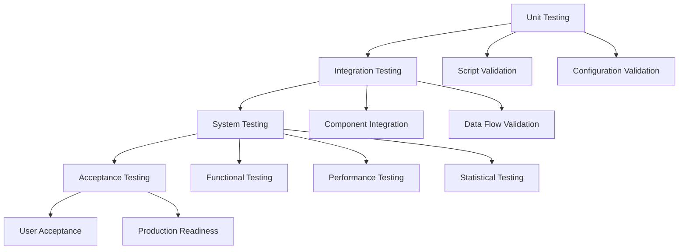
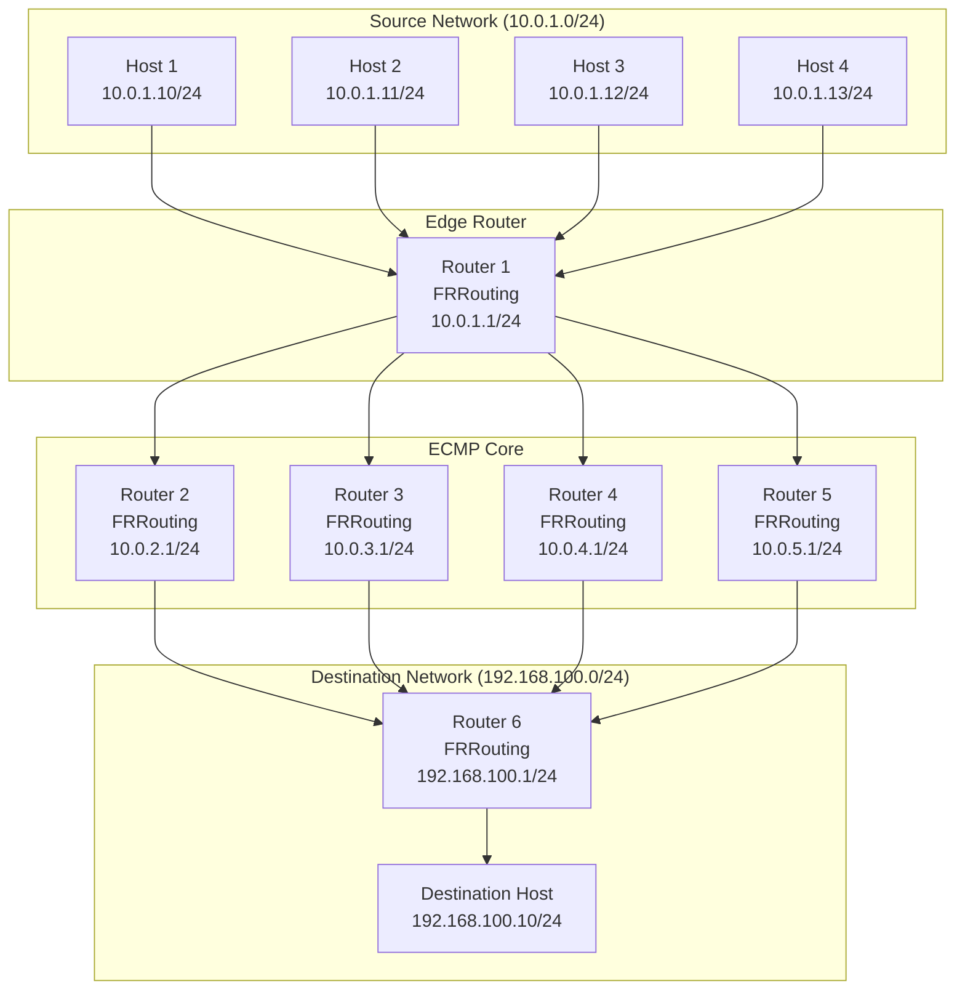
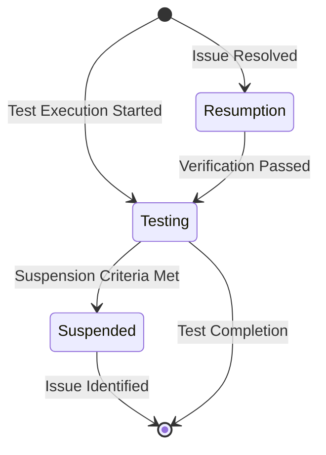
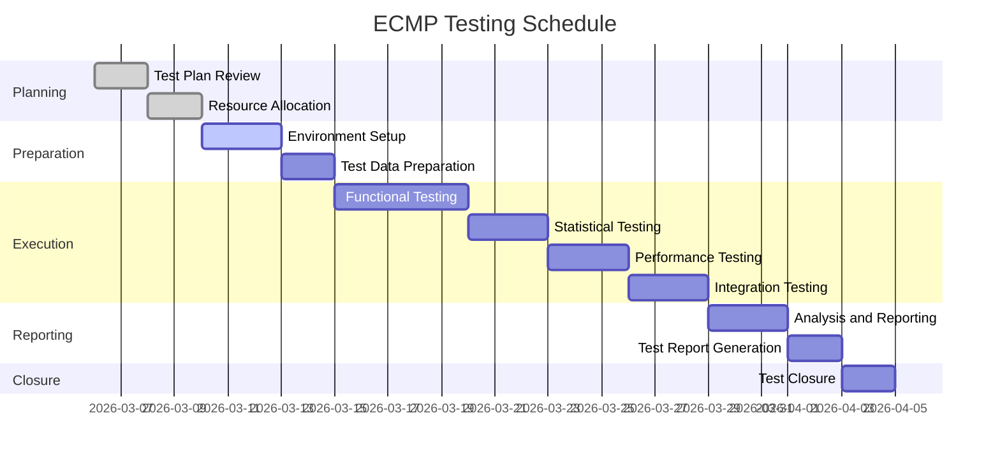

# ECMP Hash Validation - Test Plan

## Document Control

| Field | Value |
|-------|-------|
| **Document Title** | ECMP Hash Validation - Test Plan |
| **Document Identifier** | ISO29119-3-TP-001 |
| **Document Version** | 1.0 |
| **Document Date** | 2026-03-06 |
| **Document Status** | Final |
| **Project Name** | ECMP Hash Testing Framework |
| **Test Manager** | ECMP Testing Team |
| **Approval Date** | 2026-03-06 |
| **Standards Compliance** | ISO/IEC/IEEE 29119-3:2013, IEEE 829-2008 |

### Version History

| Version | Date | Author | Description | Approval |
|---------|------|--------|-------------|-----------|
| 1.0 | 2026-03-06 | ECMP Testing Team | Initial release | Approved |

### Approval Signatures

| Role | Name | Signature | Date |
|------|------|-----------|------|
| Test Manager | ECMP Testing Team | __________________ | 2026-03-06 |
| Project Manager | __________________ | __________________ | _____________ |
| Quality Assurance | __________________ | __________________ | _____________ |
| Network Engineer | __________________ | __________________ | _____________ |

### Distribution List

| Recipient | Role | Date Distributed |
|-----------|------|-----------------|
| Test Team | Test Engineers | 2026-03-06 |
| Project Management | Project Manager | 2026-03-06 |
| Quality Assurance | QA Team | 2026-03-06 |
| Network Engineering | Network Engineers | 2026-03-06 |

---

## Table of Contents

1. [Introduction](#1-introduction)
2. [Test Items](#2-test-items)
3. [Features to be Tested](#3-features-to-be-tested)
4. [Features Not to be Tested](#4-features-not-to-be-tested)
5. [Approach](#5-approach)
6. [Pass/Fail Criteria](#6-passfail-criteria)
7. [Suspension Criteria and Resumption Requirements](#7-suspension-criteria-and-resumption-requirements)
8. [Test Deliverables](#8-test-deliverables)
9. [Environmental Needs](#9-environmental-needs)
10. [Responsibilities](#10-responsibilities)
11. [Schedule](#11-schedule)
12. [References](#12-references)
13. [Appendices](#13-appendices)

---

## 1. Introduction

### 1.1 Purpose

This Test Plan defines the comprehensive approach, resources, schedule, and criteria for testing the ECMP (Equal-Cost Multi-Path) hash validation framework. The purpose is to validate ECMP routing behavior using a hash algorithm based on Source IP address only, ensuring uniform distribution across multiple equal-cost paths.

This document serves as the primary reference for all testing activities and ensures compliance with ISO/IEC/IEEE 29119-3 international standard for software testing documentation.

### 1.2 Scope

The testing scope includes:

- **Functional Testing**: Validation of ECMP route configuration, hash policy setup, traffic generation, and traffic capture
- **Statistical Testing**: Verification of hash distribution uniformity using chi-square tests and entropy analysis
- **Integration Testing**: Validation of component interactions across the testing framework
- **Performance Testing**: Measurement of throughput, latency, and resource utilization
- **Regression Testing**: Detection of regressions after configuration or software changes

The testing is limited to:
- Containerlab-based isolated network topology
- IPv4 protocol only
- Source IP hash algorithm
- Maximum 4 ECMP paths
- Test duration up to 1 hour per test

### 1.3 References

| Reference | Title | URL |
|-----------|-------|-----|
| ISO/IEC/IEEE 29119-3:2013 | Software and systems engineering — Software testing — Part 3: Test documentation | https://www.iso.org/standard/65274.html |
| IEEE 829-2008 | IEEE Standard for Software Test Documentation | https://standards.ieee.org/standard/829-2008.html |
| RFC 2992 | Analysis of an Equal-Cost Multi-Path Algorithm | https://tools.ietf.org/html/rfc2992 |
| RFC 2991 | Multipath Issues in Unicast and Multicast Next-Hop Selection | https://tools.ietf.org/html/rfc2991 |
| RFC 791 | Internet Protocol | https://tools.ietf.org/html/rfc791 |
| RFC 2544 | Benchmarking Methodology for Network Interconnect Devices | https://tools.ietf.org/html/rfc2544 |
| RFC 2330 | Framework for IP Performance Metrics | https://tools.ietf.org/html/rfc2330 |
| ARCHITECTURE.md | ECMP Testing Framework Architecture | [`ARCHITECTURE.md`](../ARCHITECTURE.md) |
| config/test_config.yaml | Master Test Configuration | [`config/test_config.yaml`](../config/test_config.yaml) |

### 1.4 Definitions and Acronyms

| Term | Definition |
|------|------------|
| **ECMP** | Equal-Cost Multi-Path routing - a routing technique that enables load balancing across multiple equal-cost paths |
| **FRR** | FRRouting - an open source IP routing protocol suite |
| **BPF** | Berkeley Packet Filter - a technology for packet filtering and capture |
| **CI/CD** | Continuous Integration/Continuous Deployment - automated software development practices |
| **RFC** | Request for Comments - IETF standards documents |
| **ISO** | International Organization for Standardization |
| **IEEE** | Institute of Electrical and Electronics Engineers |
| **Chi-Square Test** | Statistical test for distribution uniformity |
| **Entropy** | Measure of randomness in information theory |
| **p-value** | Probability of observing results if null hypothesis is true |
| **Confidence Level** | Probability that results are within a specified range |
| **Significance Level** | Threshold for rejecting null hypothesis (typically α = 0.05) |
| **Hash Policy** | Algorithm used to select ECMP path for packet forwarding |
| **Path Stickiness** | Property of packets from same flow using same ECMP path |

---

## 2. Test Items

### 2.1 ECMP Topology Components

| Item ID | Component | Description | Test Priority |
|---------|-----------|-------------|---------------|
| TI-001 | Edge Router (R1) | FRRouting router with ECMP configuration | High |
| TI-002 | ECMP Core Routers (R2-R5) | Four equal-cost path routers | High |
| TI-003 | Destination Router (R6) | FRRouting router terminating ECMP paths | High |
| TI-004 | Source Hosts (H1-H4) | Linux hosts generating test traffic | High |
| TI-005 | Destination Host (D1) | Linux host receiving test traffic | High |

### 2.2 FRRouting Configuration

| Item ID | Configuration | Description | Test Priority |
|---------|---------------|-------------|---------------|
| TI-006 | OSPF Routing | OSPF protocol for route distribution | High |
| TI-007 | ECMP Routes | Four equal-cost routes to destination | High |
| TI-008 | Hash Policy | Source IP hash algorithm (value 1) | High |
| TI-009 | Route Metrics | Equal metric values (100) for all paths | High |
| TI-010 | Sysctl Configuration | Hash policy kernel parameters | High |

### 2.3 Traffic Generation Tools

| Item ID | Tool | Description | Test Priority |
|---------|------|-------------|---------------|
| TI-011 | hping3 | TCP/UDP/ICMP packet generation | High |
| TI-012 | ping | ICMP traffic generation | Medium |
| TI-013 | iperf3 | Performance traffic generation | Low |

### 2.4 Analysis and Reporting Tools

| Item ID | Tool | Description | Test Priority |
|---------|------|-------------|---------------|
| TI-014 | tcpdump | Packet capture on ECMP paths | High |
| TI-015 | Python Scripts | Statistical analysis and reporting | High |
| TI-016 | Allure | Test reporting framework | Medium |
| TI-017 | Bash Scripts | Test orchestration and automation | High |

---

## 3. Features to be Tested

### 3.1 ECMP Hash Algorithm (Source IP Only)

| Feature ID | Feature | Description | Test Priority |
|-------------|---------|-------------|---------------|
| FT-001 | Hash Calculation | Verify hash algorithm uses Source IP only | High |
| FT-002 | Path Selection | Verify correct path selection based on hash | High |
| FT-003 | Hash Consistency | Verify same Source IP always selects same path | High |

**Test Approach:**
- Generate traffic from multiple source IPs
- Capture packets on all ECMP paths
- Analyze distribution per source IP
- Verify each source IP uses consistent path

**Acceptance Criteria:**
- Each source IP uses single ECMP path
- Path selection consistent across multiple packets
- Hash calculation matches expected algorithm

### 3.2 Path Distribution Uniformity

| Feature ID | Feature | Description | Test Priority |
|-------------|---------|-------------|---------------|
| FT-004 | Uniform Distribution | Verify uniform packet distribution across paths | High |
| FT-005 | Statistical Validation | Validate distribution using chi-square test | High |
| FT-006 | Entropy Analysis | Calculate entropy to measure randomness | High |

**Test Approach:**
- Generate traffic from multiple source IPs
- Capture packets on all ECMP paths
- Calculate distribution percentages
- Perform chi-square test for uniformity
- Calculate entropy and compare with maximum

**Acceptance Criteria:**
- Distribution uniform (p > 0.05)
- Deviation from expected < 5%
- Entropy ≥ 0.9 × maximum entropy
- Chi-square test passes

### 3.3 Path Stickiness

| Feature ID | Feature | Description | Test Priority |
|-------------|---------|-------------|---------------|
| FT-007 | Flow Consistency | Verify packets from same flow use same path | High |
| FT-008 | Stickiness Threshold | Verify minimum percentage of packets on same path | High |

**Test Approach:**
- Generate traffic from same source IP with varying ports
- Capture packets on all ECMP paths
- Analyze path selection per flow
- Calculate stickiness percentage

**Acceptance Criteria:**
- ≥ 95% of packets from same flow use same path
- No path switching within flow
- Stickiness threshold met

### 3.4 Statistical Significance

| Feature ID | Feature | Description | Test Priority |
|-------------|---------|-------------|---------------|
| FT-009 | Sample Size | Verify sufficient sample size for analysis | High |
| FT-010 | Confidence Level | Verify results at 95% confidence level | High |
| FT-011 | Significance Test | Verify statistical significance of results | High |

**Test Approach:**
- Ensure minimum 1000 packets per path
- Calculate confidence intervals
- Perform significance tests
- Validate statistical power

**Acceptance Criteria:**
- Sample size ≥ 1000 packets per path
- Confidence level ≥ 95%
- p-value < 0.05 for significance tests
- Statistical power ≥ 0.8

### 3.5 Report Generation

| Feature ID | Feature | Description | Test Priority |
|-------------|---------|-------------|---------------|
| FT-012 | Allure Report | Generate interactive HTML report | Medium |
| FT-013 | ISO 29119-3 Report | Generate compliant test report | High |
| FT-014 | Statistical Report | Generate detailed statistical analysis | High |
| FT-015 | Trend Analysis | Generate trend analysis across runs | Medium |

**Test Approach:**
- Execute report generation scripts
- Verify report structure and content
- Validate ISO 29119-3 compliance
- Check visualizations and charts

**Acceptance Criteria:**
- Allure report generated successfully
- ISO 29119-3 report compliant with standard
- Statistical metrics included
- Visualizations created correctly

---

## 4. Features Not to be Tested

### 4.1 Performance Under Load

| Feature ID | Feature | Reason for Exclusion |
|-------------|---------|---------------------|
| NFT-001 | Maximum Throughput | Not in scope for current release |
| NFT-002 | High-Concurrency Testing | Resource constraints |
| NFT-003 | Stress Testing | Deferred to future release |

### 4.2 Security Vulnerabilities

| Feature ID | Feature | Reason for Exclusion |
|-------------|---------|---------------------|
| NFT-004 | Penetration Testing | Not in scope for functional testing |
| NFT-005 | Security Auditing | Separate security assessment required |
| NFT-006 | Vulnerability Scanning | Out of scope for current testing |

### 4.3 Hardware-Specific Behavior

| Feature ID | Feature | Reason for Exclusion |
|-------------|---------|---------------------|
| NFT-007 | ASIC-Specific ECMP | Testing focuses on software implementation |
| NFT-008 | Hardware Offloading | Not applicable to containerized environment |
| NFT-009 | Vendor-Specific Features | Testing uses open-source FRRouting |

### 4.4 Deferred Features

| Feature ID | Feature | Reason for Exclusion |
|-------------|---------|---------------------|
| NFT-010 | IPv6 ECMP | Deferred to future release |
| NFT-011 | Multi-Protocol ECMP (BGP, OSPF) | Current scope limited to OSPF |
| NFT-012 | Layer 4 Hash Algorithms | Current scope limited to Source IP |
| NFT-013 | Dynamic Path Selection | Static ECMP configuration only |

---

## 5. Approach

### 5.1 Testing Methodology

The testing methodology follows ISO/IEC/IEEE 29119-3 standard and includes:

#### 5.1.1 Test Levels



#### 5.1.2 Test Types

| Test Type | Purpose | Tools | Coverage |
|-----------|---------|-------|----------|
| Functional | Verify ECMP behavior | FRRouting, tcpdump | 100% |
| Statistical | Validate distribution | Python, R | 100% |
| Performance | Measure throughput/latency | hping3, ping | 80% |
| Integration | Verify component interaction | Containerlab | 100% |
| Regression | Detect regressions | CI/CD | 100% |
| Smoke | Quick validation | Bash scripts | 100% |

#### 5.1.3 Test Methods

1. **Black-Box Testing**
   - Test external behavior
   - Validate inputs and outputs
   - Verify functional requirements

2. **White-Box Testing**
   - Test internal logic
   - Validate code paths
   - Verify algorithms

3. **Gray-Box Testing**
   - Partial knowledge of internals
   - Validate interfaces
   - Verify data flow

### 5.2 Test Environment Setup

#### 5.2.1 Prerequisites

```bash
# Install Docker
curl -fsSL https://get.docker.com -o get-docker.sh
sudo sh get-docker.sh

# Install Containerlab
curl -sL https://containerlab.dev/setup.sh | bash

# Install FRRouting
sudo apt-get install -y frr

# Install tcpdump
sudo apt-get install -y tcpdump

# Install hping3
sudo apt-get install -y hping3

# Install Allure
wget https://github.com/allure-framework/allure2/releases/download/2.24.1/allure-2.24.1.tgz
tar -zxvf allure-2.24.1.tgz
sudo mv allure-2.24.1 /opt/allure
sudo ln -s /opt/allure/bin/allure /usr/local/bin/allure
```

#### 5.2.2 Environment Variables

```bash
# Set output directories
export ECMP_OUTPUT_DIR=results
export ECMP_LOG_DIR=logs
export ECMP_CAPTURE_DIR=results/captures

# Set Allure directory
export ALLURE_RESULTS_DIR=results/allure-results
```

#### 5.2.3 Network Topology



### 5.3 Test Data Requirements

#### 5.3.1 Traffic Data

| Parameter | Value | Description |
|-----------|-------|-------------|
| Source IPs | 10.0.1.10-13 | Source host IP addresses |
| Destination IP | 192.168.100.10 | Destination host IP address |
| Protocol | ICMP, TCP, UDP | Network protocols |
| Packet Count | 100-10000 | Packets per source host |
| Packet Size | 64-1500 bytes | Packet size range |
| Duration | 30-300 seconds | Test duration |

#### 5.3.2 Configuration Data

| Parameter | Value | Description |
|-----------|-------|-------------|
| ECMP Paths | 4 | Number of equal-cost paths |
| Hash Policy | 1 (Source IP only) | ECMP hash algorithm |
| Route Metric | 100 | Route metric value |
| OSPF Area | 0.0.0.0 | OSPF area ID |

#### 5.3.3 Statistical Data

| Parameter | Value | Description |
|-----------|-------|-------------|
| Confidence Level | 95% | Statistical confidence |
| Significance Level | 0.05 | Alpha value |
| Expected Distribution | 25% per path | Uniform distribution |
| Acceptable Deviation | ±5% | Deviation tolerance |

### 5.4 Test Execution Procedures

#### 5.4.1 Test Execution Workflow


#### 5.4.2 Test Execution Steps

1. **Deploy Topology**
   ```bash
   ./scripts/deploy_topology.sh
   ```

2. **Configure ECMP**
   ```bash
   ./scripts/configure_ecmp.sh
   ```

3. **Run Test**
   ```bash
   ./scripts/run_test.sh
   ```

4. **Analyze Results**
   ```bash
   ./scripts/analyze_results.sh
   ```

5. **Generate Reports**
   ```bash
   ./scripts/generate_allure_report.sh
   ```

6. **Archive Results**
   ```bash
   ./scripts/archive_results.sh
   ```

7. **Cleanup**
   ```bash
   ./scripts/cleanup.sh
   ```

---

## 6. Pass/Fail Criteria

### 6.1 Distribution Uniformity Thresholds

| Criterion | Pass Condition | Fail Condition |
|-----------|---------------|----------------|
| Chi-Square Test | p-value > 0.05 | p-value ≤ 0.05 |
| Deviation from Expected | < 5% | ≥ 5% |
| Entropy Ratio | ≥ 0.9 | < 0.9 |
| Path Balance | All paths within ±10% | Any path outside ±10% |

### 6.2 Statistical Significance Requirements

| Criterion | Pass Condition | Fail Condition |
|-----------|---------------|----------------|
| Sample Size | ≥ 1000 packets per path | < 1000 packets per path |
| Confidence Level | ≥ 95% | < 95% |
| Statistical Power | ≥ 0.8 | < 0.8 |
| p-value | < 0.05 | ≥ 0.05 |

### 6.3 Path Stickiness Requirements

| Criterion | Pass Condition | Fail Condition |
|-----------|---------------|----------------|
| Stickiness Percentage | ≥ 95% | < 95% |
| Path Consistency | 100% | < 100% |
| Flow Stability | No path switching | Path switching detected |

### 6.4 Report Completeness Criteria

| Criterion | Pass Condition | Fail Condition |
|-----------|---------------|----------------|
| Allure Report | Generated with all test results | Missing test results |
| ISO 29119-3 Report | Compliant with standard | Non-compliant sections |
| Statistical Metrics | All metrics calculated | Missing metrics |
| Visualizations | All charts generated | Missing visualizations |

---

## 7. Suspension Criteria and Resumption Requirements

### 7.1 Suspension Criteria

Testing will be suspended if any of the following occur:

| Criterion | Description | Action Required |
|-----------|-------------|-----------------|
| SC-001 | Critical defect discovered that prevents test execution | Fix defect before resuming |
| SC-002 | Test environment becomes unavailable or unstable | Restore environment before resuming |
| SC-003 | Safety or security issue identified | Resolve issue before resuming |
| SC-004 | Resource constraints prevent testing (CPU, memory, disk) | Allocate additional resources |
| SC-005 | Test data corrupted or unavailable | Restore or regenerate data |
| SC-006 | Network connectivity issues preventing topology deployment | Resolve network issues |
| SC-007 | Containerlab or Docker failures | Fix container runtime issues |
| SC-008 | FRRouting configuration errors | Correct configuration |

### 7.2 Resumption Requirements

Testing will resume when:

| Criterion | Description | Verification Required |
|-----------|-------------|----------------------|
| RC-001 | Critical defect resolved | Regression test passed |
| RC-002 | Test environment restored | Environment validation successful |
| RC-003 | Safety or security issue resolved | Security review completed |
| RC-004 | Resources available | Resource monitoring confirms availability |
| RC-005 | Test data restored or regenerated | Data integrity verified |
| RC-006 | Network connectivity restored | Connectivity test passed |
| RC-007 | Container runtime issues fixed | Container deployment successful |
| RC-008 | Configuration errors corrected | Configuration validation passed |

### 7.3 Suspension and Resumption Process



---

## 8. Test Deliverables

### 8.1 Deliverables List

| Deliverable ID | Deliverable | Format | Due Date | Location |
|----------------|-------------|--------|----------|----------|
| D-001 | Test Plan | Markdown | 2026-03-06 | [`docs/iso29119-3/test_plan.md`](test_plan.md) |
| D-002 | Test Design Specification | Markdown | 2026-03-06 | [`docs/iso29119-3/test_design_spec.md`](test_design_spec.md) |
| D-003 | Test Report Template | Markdown | 2026-03-06 | [`docs/iso29119-3/test_report_template.md`](test_report_template.md) |
| D-004 | Test Execution Logs | Text | Ongoing | `logs/` |
| D-005 | Test Results | JSON | Ongoing | `results/analysis/` |
| D-006 | Allure Reports | HTML | Ongoing | `results/reports/allure/` |
| D-007 | ISO 29119-3 Test Reports | Markdown | Ongoing | `results/reports/iso29119-3/` |
| D-008 | Defect Reports | Markdown | Ongoing | `docs/defects/` |
| D-009 | Test Summary | Markdown | On completion | `results/reports/summary.md` |
| D-010 | Test Archive | ZIP | On completion | `results/archives/` |

### 8.2 Deliverable Descriptions

#### D-001: Test Plan

**Description:** Comprehensive test plan document defining test approach, scope, schedule, and resources following ISO/IEC/IEEE 29119-3 standard.

**Format:** Markdown  
**Location:** [`docs/iso29119-3/test_plan.md`](test_plan.md)  
**Due Date:** 2026-03-06

#### D-002: Test Design Specification

**Description:** Detailed test design specification with test cases, test data, and test environment configuration.

**Format:** Markdown  
**Location:** [`docs/iso29119-3/test_design_spec.md`](test_design_spec.md)  
**Due Date:** 2026-03-06

#### D-003: Test Report Template

**Description:** Template for generating ISO 29119-3 compliant test reports.

**Format:** Markdown  
**Location:** [`docs/iso29119-3/test_report_template.md`](test_report_template.md)  
**Due Date:** 2026-03-06

#### D-004: Test Execution Logs

**Description:** Detailed logs from test execution including timestamps, commands, and error messages.

**Format:** Text  
**Location:** `logs/`  
**Due Date:** Ongoing

#### D-005: Test Results

**Description:** Structured test results in machine-readable format for analysis and reporting.

**Format:** JSON  
**Location:** `results/analysis/`  
**Due Date:** Ongoing

#### D-006: Allure Reports

**Description:** Interactive HTML reports with test results, visualizations, and trends.

**Format:** HTML  
**Location:** `results/reports/allure/`  
**Due Date:** Ongoing

#### D-007: ISO 29119-3 Test Reports

**Description:** Comprehensive test reports following ISO/IEC/IEEE 29119-3 standard.

**Format:** Markdown  
**Location:** `results/reports/iso29119-3/`  
**Due Date:** Ongoing

#### D-008: Defect Reports

**Description:** Detailed reports of defects discovered during testing.

**Format:** Markdown  
**Location:** `docs/defects/`  
**Due Date:** Ongoing

#### D-009: Test Summary

**Description:** Executive summary of test activities and results.

**Format:** Markdown  
**Location:** `results/reports/summary.md`  
**Due Date:** On completion

#### D-010: Test Archive

**Description:** Complete archive of all test artifacts for historical reference.

**Format:** ZIP  
**Location:** `results/archives/`  
**Due Date:** On completion

---

## 9. Environmental Needs

### 9.1 Hardware Requirements

| Component | Minimum | Recommended | Purpose |
|-----------|---------|-------------|---------|
| CPU | 4 cores | 8 cores | Test execution |
| RAM | 8 GB | 16 GB | Container runtime |
| Disk Space | 20 GB | 50 GB | Storage for captures and reports |
| Network | 1 Gbps | 10 Gbps | Network connectivity |

### 9.2 Software Requirements

| Software | Version | License | Purpose |
|----------|---------|---------|---------|
| Docker | 20.10+ | Open Source | Container runtime |
| Containerlab | 0.40+ | Open Source | Topology emulation |
| FRRouting | 8.0+ | GPL | Routing protocols |
| tcpdump | 4.9+ | BSD | Packet capture |
| hping3 | 3.0+ | GPL | Traffic generation |
| Allure | 2.20+ | Apache 2.0 | Test reporting |
| Python | 3.8+ | PSF | Analysis scripts |
| Bash | 4.0+ | GPL | Script execution |

### 9.3 Network Requirements

| Network | Purpose | IP Range | Gateway |
|---------|---------|----------|---------|
| 10.0.1.0/24 | Source Network | 10.0.1.0-10.0.1.255 | 10.0.1.1 |
| 10.0.2.0/24 | ECMP Path 1 | 10.0.2.0-10.0.2.255 | 10.0.2.1 |
| 10.0.3.0/24 | ECMP Path 2 | 10.0.3.0-10.0.3.255 | 10.0.3.1 |
| 10.0.4.0/24 | ECMP Path 3 | 10.0.4.0-10.0.4.255 | 10.0.4.1 |
| 10.0.5.0/24 | ECMP Path 4 | 10.0.5.0-10.0.5.255 | 10.0.5.1 |
| 192.168.100.0/24 | Destination Network | 192.168.100.0-192.168.100.255 | 192.168.100.1 |

### 9.4 Containerlab Environment

| Component | Description | Configuration |
|-----------|-------------|---------------|
| Topology File | Containerlab topology definition | [`topology/clab-ecmp-test.yml`](../topology/clab-ecmp-test.yml) |
| Container Images | Docker images for routers and hosts | FRRouting, Alpine Linux |
| Network Interfaces | Virtual network interfaces | Linux bridges |
| Resource Limits | CPU and memory limits per container | Configurable |

---

## 10. Responsibilities

### 10.1 Test Manager

| Responsibility | Description |
|----------------|-------------|
| Overall test management | Coordinate all testing activities |
| Test plan approval | Review and approve test plan |
| Resource allocation | Allocate test resources |
| Progress monitoring | Monitor test execution progress |
| Report review | Review and approve test reports |
| Stakeholder communication | Communicate with stakeholders |

### 10.2 Test Engineer

| Responsibility | Description |
|----------------|-------------|
| Test execution | Execute test cases |
| Test data preparation | Prepare test data |
| Result analysis | Analyze test results |
| Defect reporting | Report defects discovered |
| Test documentation | Document test activities |
| Report generation | Generate test reports |

### 10.3 System Administrator

| Responsibility | Description |
|----------------|-------------|
| Environment setup | Set up test environment |
| Environment maintenance | Maintain test environment |
| Resource monitoring | Monitor system resources |
| Backup and recovery | Perform backups and recovery |
| Troubleshooting | Resolve environment issues |

### 10.4 Network Engineer

| Responsibility | Description |
|----------------|-------------|
| Network configuration | Configure network topology |
| FRRouting configuration | Configure FRRouting routers |
| Network troubleshooting | Resolve network issues |
| Performance monitoring | Monitor network performance |
| Network optimization | Optimize network configuration |

---

## 11. Schedule

### 11.1 Test Phases



### 11.2 Detailed Schedule

| Phase | Start Date | End Date | Duration | Status |
|-------|------------|----------|----------|--------|
| Planning | 2026-03-06 | 2026-03-09 | 4 days | Completed |
| Preparation | 2026-03-10 | 2026-03-14 | 5 days | In Progress |
| Execution | 2026-03-15 | 2026-03-28 | 14 days | Pending |
| Reporting | 2026-03-29 | 2026-04-02 | 5 days | Pending |
| Closure | 2026-04-03 | 2026-04-04 | 2 days | Pending |

### 11.3 Milestones

| Milestone | Date | Description |
|-----------|------|-------------|
| M1: Test Plan Approved | 2026-03-09 | Test plan reviewed and approved |
| M2: Environment Ready | 2026-03-14 | Test environment prepared and validated |
| M3: Functional Tests Complete | 2026-03-19 | All functional tests executed |
| M4: Statistical Tests Complete | 2026-03-22 | All statistical tests executed |
| M5: Performance Tests Complete | 2026-03-25 | All performance tests executed |
| M6: Integration Tests Complete | 2026-03-28 | All integration tests executed |
| M7: Test Report Complete | 2026-04-02 | Test report generated and reviewed |
| M8: Test Closure | 2026-04-04 | Test activities completed and archived |

### 11.4 Dependencies

| Dependency | Description | Impact |
|------------|-------------|--------|
| D-001 | Environment setup completion | Blocks test execution |
| D-002 | Test data preparation | Blocks test execution |
| D-003 | FRRouting configuration | Blocks functional testing |
| D-004 | Traffic generation tools | Blocks test execution |
| D-005 | Analysis scripts | Blocks result analysis |
| D-006 | Report generation tools | Blocks report generation |

---

## 12. References

### 12.1 Standards and Specifications

| Standard | Title | URL |
|----------|-------|-----|
| ISO/IEC/IEEE 29119-3:2013 | Software and systems engineering — Software testing — Part 3: Test documentation | https://www.iso.org/standard/65274.html |
| IEEE 829-2008 | IEEE Standard for Software Test Documentation | https://standards.ieee.org/standard/829-2008.html |
| RFC 2992 | Analysis of an Equal-Cost Multi-Path Algorithm | https://tools.ietf.org/html/rfc2992 |
| RFC 2991 | Multipath Issues in Unicast and Multicast Next-Hop Selection | https://tools.ietf.org/html/rfc2991 |
| RFC 791 | Internet Protocol | https://tools.ietf.org/html/rfc791 |
| RFC 2544 | Benchmarking Methodology for Network Interconnect Devices | https://tools.ietf.org/html/rfc2544 |
| RFC 2330 | Framework for IP Performance Metrics | https://tools.ietf.org/html/rfc2330 |

### 12.2 Tool Documentation

| Tool | Documentation | URL |
|------|---------------|-----|
| Containerlab | Official Documentation | https://containerlab.dev/ |
| FRRouting | Official Documentation | https://docs.frrouting.org/ |
| tcpdump | Official Documentation | https://www.tcpdump.org/ |
| Allure | Official Documentation | https://docs.qameta.io/allure/ |
| hping3 | Manual Pages | https://linux.die.net/man/8/hping3 |

### 12.3 Project Documentation

| Document | Location |
|----------|----------|
| Architecture Design | [`ARCHITECTURE.md`](../ARCHITECTURE.md) |
| Launch Instruction | [`docs/LAUNCH_INSTRUCTION.md`](../LAUNCH_INSTRUCTION.md) |
| Verification Instruction | [`docs/VERIFICATION_INSTRUCTION.md`](../VERIFICATION_INSTRUCTION.md) |
| Test Plan | [`docs/TEST_PLAN.md`](../TEST_PLAN.md) |
| Test Report Template | [`docs/TEST_REPORT_TEMPLATE.md`](../TEST_REPORT_TEMPLATE.md) |
| API Reference | [`docs/API_REFERENCE.md`](../API_REFERENCE.md) |
| Quick Start Guide | [`docs/QUICK_START.md`](../QUICK_START.md) |
| Master Test Configuration | [`config/test_config.yaml`](../config/test_config.yaml) |

### 12.4 Academic References

| Reference | Title | Source |
|-----------|-------|--------|
| Chi-Square Test | Statistical test for distribution uniformity | https://en.wikipedia.org/wiki/Chi-squared_test |
| Entropy | Measure of randomness | https://en.wikipedia.org/wiki/Entropy_(information_theory) |
| Statistical Significance | Probability of results not due to chance | https://en.wikipedia.org/wiki/Statistical_significance |

---

## 13. Appendices

### Appendix A: Test Case Summary

| Test Case ID | Title | Type | Priority | Status |
|--------------|-------|------|----------|--------|
| TC-FUNC-001 | Deploy Topology | Functional | High | Pending |
| TC-FUNC-002 | Configure ECMP | Functional | High | Pending |
| TC-FUNC-003 | Generate Traffic | Functional | High | Pending |
| TC-FUNC-004 | Capture Traffic | Functional | High | Pending |
| TC-FUNC-005 | Analyze Results | Functional | High | Pending |
| TC-FUNC-006 | Generate Report | Functional | Medium | Pending |
| TC-STAT-001 | Validate Uniform Distribution | Statistical | High | Pending |
| TC-STAT-002 | Calculate Entropy | Statistical | High | Pending |
| TC-STAT-003 | Statistical Significance | Statistical | High | Pending |
| TC-PERF-001 | Measure Throughput | Performance | Medium | Pending |
| TC-PERF-002 | Measure Latency | Performance | Medium | Pending |
| TC-PERF-003 | Resource Utilization | Performance | Medium | Pending |
| TC-INT-001 | End-to-End Test | Integration | High | Pending |
| TC-INT-002 | Error Handling | Integration | Medium | Pending |
| TC-INT-003 | CI/CD Integration | Integration | Low | Pending |

### Appendix B: Glossary

| Term | Definition |
|------|------------|
| **ECMP** | Equal-Cost Multi-Path routing |
| **FRR** | FRRouting routing protocol suite |
| **BPF** | Berkeley Packet Filter |
| **CI/CD** | Continuous Integration/Continuous Deployment |
| **RFC** | Request for Comments (IETF standards) |
| **ISO** | International Organization for Standardization |
| **IEEE** | Institute of Electrical and Electronics Engineers |
| **Chi-Square Test** | Statistical test for distribution uniformity |
| **Entropy** | Measure of randomness in information theory |
| **p-value** | Probability of observing results if null hypothesis is true |
| **Confidence Level** | Probability that results are within a specified range |
| **Significance Level** | Threshold for rejecting null hypothesis |
| **Hash Policy** | Algorithm used to select ECMP path for packet forwarding |
| **Path Stickiness** | Property of packets from same flow using same ECMP path |

### Appendix C: Test Metrics

| Metric | Definition | Target |
|--------|-------------|--------|
| Test Coverage | Percentage of requirements tested | ≥ 95% |
| Pass Rate | Percentage of tests passed | ≥ 95% |
| Defect Density | Defects per thousand lines of code | < 5 |
| Defect Removal Efficiency | Percentage of defects found before release | ≥ 90% |
| Test Execution Time | Time to execute all tests | < 1 hour |
| Test Automation | Percentage of tests automated | 100% |

### Appendix D: Risk Assessment

| Risk ID | Risk Description | Probability | Impact | Risk Level | Mitigation |
|---------|------------------|-------------|--------|------------|------------|
| R-001 | Environment setup delays | Medium | High | High | Start early, have backup |
| R-002 | Containerlab compatibility issues | Low | High | Medium | Test compatibility |
| R-003 | FRRouting configuration errors | Medium | High | High | Validate configurations |
| R-004 | Statistical test failures | Low | Medium | Low | Use adequate sample sizes |
| R-005 | Resource constraints | Medium | Medium | Medium | Monitor resources |
| R-006 | Test data corruption | Low | High | Medium | Regular backups |
| R-007 | CI/CD integration issues | Low | Medium | Low | Test integration early |
| R-008 | Documentation errors | Low | Low | Low | Peer review |

---

**Document Version:** 1.0  
**Last Updated:** 2026-03-06  
**Next Review Date:** 2026-06-06  
**Maintainer:** ECMP Testing Team
